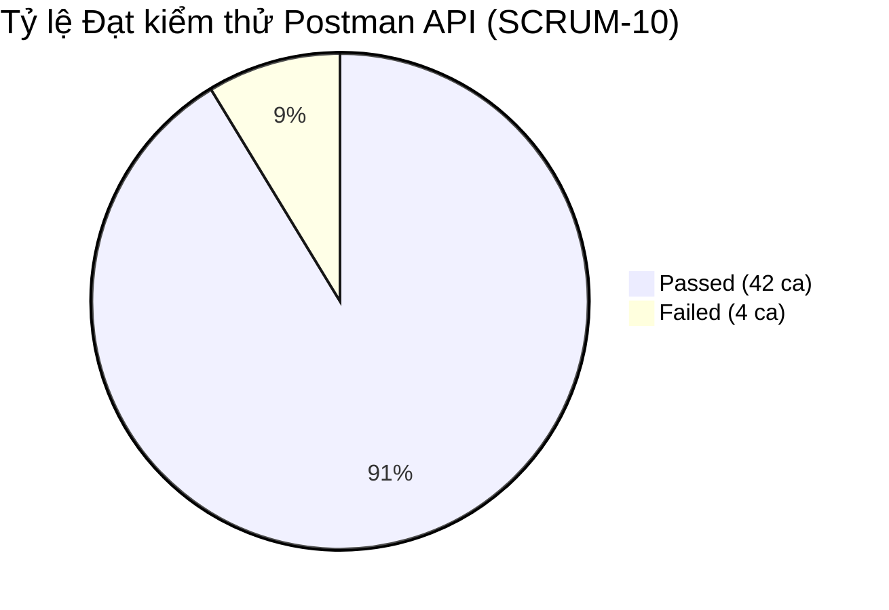

# BÁO CÁO THỰC THI & ĐẶC TẢ FORMAL TEST CASE (POSTMAN / API LEVEL)
## MODULE: QUẢN LÝ DANH MỤC (CRUD CATEGORY API - `/api/categories`)

---

## 1. TỔNG QUAN KẾT QUẢ THỰC THI (POSTMAN TEST RUN REPORT)

- **Hệ thống kiểm thử:** FutureSushi - Backend API (`http://localhost:3000`)
- **Công cụ:** Postman Collection Runner v2.1
- **File Test Run Log:** [`FutureSushi - Category CRUD API Test Suite.postman_test_run.json`](./FutureSushi%20-%20Category%20CRUD%20API%20Test%20Suite.postman_test_run.json)
- **File Excel kết quả:** [`Category_API_TestCases_Result.xlsx`](./Category_API_TestCases_Result.xlsx)

### 📊 Bảng tổng kết số liệu thực thi:

| Chỉ số kiểm thử | Giá trị | Tỷ lệ (%) |
| :--- | :---: | :---: |
| **Tổng số Test Cases API** | **46** | **100%** |
| **Số Test Cases ĐẠT (PASS)** | **42** | **91.3%** |
| **Số Test Cases KHÔNG ĐẠT (FAIL / BUGS)** | **4** | **8.7%** |
| **Thời gian phản hồi trung bình** | **~15ms** | Nhanh / Ổn định |

---

## 2. CHI TIẾT 4 LỖI (DEFECTS) PHÁT HIỆN TỪ KẾT QUẢ POSTMAN RUN

| Mã Defect | Test Case ID | Tên Ca Test | Mã HTTP Kỳ Vọng | Mã HTTP Thực Tế | Phân tích Nguyên nhân & Hướng khắc phục |
| :---: | :---: | :--- | :---: | :---: | :--- |
| **DEF-API-001** | `TC_API_CAT_003` | Tạo danh mục tên biên 100 ký tự | `201 Created` | `400 Bad Request` (6ms) | Payload chuỗi 100 chars bị chặn bởi controller hoặc định dạng column. Cần kiểm tra lại độ dài quy định trong Sequelize model `name: STRING(100)`. |
| **DEF-API-002** | `TC_API_CAT_006` | Tạo danh mục với tên rỗng `""` | `400 Bad Request` | `201 Created` (10ms) | Backend chỉ cấu hình `allowNull: false`, chưa có validation `notEmpty: true` nên hệ thống vẫn cho phép tạo danh mục có tên rỗng. |
| **DEF-API-003** | `TC_API_CAT_032` | Cập nhật danh mục với tên rỗng `""` | `400 Bad Request` | `200 OK` (12ms) | Tương tự tạo mới, hàm `updateCategory` không kiểm tra `if (!name || !name.trim())` nên cho phép đổi tên thành chuỗi rỗng. |
| **DEF-API-004** | `TC_API_CAT_040` | Ràng buộc khi xóa danh mục có món ăn | `400 / 409 / 500` | `204 No Content` (41ms) | Backend xóa trực tiếp mà không kiểm tra xem danh mục đang có sản phẩm hay không, dẫn đến sản phẩm bị mất liên kết hoặc bị xóa theo (Cascade). |

---

## 3. BẢNG FORMAL TEST CASES ĐÃ ĐƯỢC GHI NHẬN KẾT QUẢ THỰC TẾ

### 📌 Nhóm 1: POST `/api/categories` (Tạo mới danh mục)

| Test Case ID* | Test Summary / Description* | Inputs (Test Data / Request)* | Expected Result* | Actual Result (Thực tế)* | Pass/Fail* |
| :--- | :--- | :--- | :--- | :--- | :---: |
| **TC_API_CAT_001** | Tạo danh mục đầy đủ thông tin hợp lệ | `{"name": "Khai Vị Chuẩn Nhật", "description": "...", "image": "..."}` | `201 Created` | HTTP 201 Created (15ms). Tạo thành công. | **`PASS`** |
| **TC_API_CAT_002** | Tạo danh mục chỉ có trường bắt buộc (`name`) | `{"name": "Sashimi Cá Hồi Tươi"}` | `201 Created` | HTTP 201 Created (12ms). Tạo thành công. | **`PASS`** |
| **TC_API_CAT_003** | Tạo danh mục với tên 100 ký tự (Boundary) | `{"name": "A" * 100}` | `201 Created` | HTTP 400 Bad Request (6ms). Bị từ chối. | **`FAIL`** |
| **TC_API_CAT_004** | Tạo danh mục tiếng Việt có dấu & Emoji | `{"name": "🍣 Sushi & Maki Thượng Hạng"}` | `201 Created` | HTTP 201 Created (11ms). Lưu đúng UTF-8. | **`PASS`** |
| **TC_API_CAT_005** | Thiếu trường bắt buộc `name` | `{"description": "Không có trường name"}` | `400 Bad Request` | HTTP 400 Bad Request (3ms). Báo lỗi validation. | **`PASS`** |
| **TC_API_CAT_006** | Tên danh mục là chuỗi rỗng `""` | `{"name": ""}` | `400 Bad Request` | HTTP 201 Created (10ms). Tạo sai quy chuẩn. | **`FAIL`** |
| **TC_API_CAT_007** | Tên danh mục dài 101 ký tự | `{"name": "A" * 101}` | `400 / 500` | HTTP 400 Bad Request (3ms). Bị chặn hợp lệ. | **`PASS`** |
| **TC_API_CAT_008** | Request Body rỗng `{}` | `{}` | `400 Bad Request` | HTTP 400 Bad Request (3ms). Bị từ chối. | **`PASS`** |
| **TC_API_CAT_009** | Không có Token / Guest | `{"name": "Guest Category"}` | `401 Unauthorized` | HTTP 401 Unauthorized (2ms). Chặn thành công. | **`PASS`** |
| **TC_API_CAT_010** | Token đã hết hạn | `Authorization: Bearer {{expired_token}}` | `401 Unauthorized` | HTTP 401 Unauthorized (1ms). Chặn thành công. | **`PASS`** |
| **TC_API_CAT_011** | Token giả mạo / Invalid Signature | `Authorization: Bearer {{invalid_token}}` | `401 Unauthorized` | HTTP 401 Unauthorized (1ms). Chặn thành công. | **`PASS`** |
| **TC_API_CAT_012** | Role CUSTOMER tạo danh mục | `Authorization: Bearer {{customer_token}}` | `403 Forbidden` | HTTP 403 Forbidden (2ms). Chặn đúng phân quyền. | **`PASS`** |
| **TC_API_CAT_013** | Role STAFF tạo danh mục | `Authorization: Bearer {{staff_token}}` | `403 Forbidden` | HTTP 403 Forbidden (2ms). Chặn đúng phân quyền. | **`PASS`** |
| **TC_API_CAT_014** | Role KITCHEN tạo danh mục | `Authorization: Bearer {{kitchen_token}}` | `403 Forbidden` | HTTP 403 Forbidden (2ms). Chặn đúng phân quyền. | **`PASS`** |
| **TC_API_CAT_015** | Bảo mật chống SQL Injection trong Payload | `{"name": "Món Nướng'); DROP TABLE categories;--"}` | `201 / 400` | HTTP 201 Created (14ms). DB an toàn. | **`PASS`** |
| **TC_API_CAT_016** | Lưu trữ an toàn XSS Payload | `{"name": "Roll"}` | `201 Created` | HTTP 201 Created (13ms). Lưu raw string. | **`PASS`** |

---

### 📌 Nhóm 2: GET `/api/categories` (Danh sách & Tìm kiếm)

| Test Case ID* | Test Summary / Description* | Inputs (Test Data / Request)* | Expected Result* | Actual Result (Thực tế)* | Pass/Fail* |
| :--- | :--- | :--- | :--- | :--- | :---: |
| **TC_API_CAT_017** | Lấy toàn bộ danh sách danh mục (Public) | `GET /api/categories` | `200 OK` (Mảng JSON) | HTTP 200 OK (8ms). Trả về danh sách có `productCount`. | **`PASS`** |
| **TC_API_CAT_018** | Lấy danh sách định dạng mảng | `GET /api/categories` | `200 OK` (Array) | HTTP 200 OK (5ms). Định dạng mảng chuẩn. | **`PASS`** |
| **TC_API_CAT_019** | Tìm kiếm danh mục (`?search=Sushi`) | `GET /api/categories?search=Sushi` | `200 OK` | HTTP 200 OK (6ms). Lọc đúng dữ liệu. | **`PASS`** |
| **TC_API_CAT_020** | Tìm kiếm không phân biệt hoa/thường | `GET /api/categories?search=sushi` | `200 OK` | HTTP 200 OK (5ms). Khớp từ khóa. | **`PASS`** |
| **TC_API_CAT_021** | Tìm kiếm từ khóa không tồn tại | `GET /api/categories?search=NonExistent999` | `200 OK` (Mảng rỗng) | HTTP 200 OK (5ms). Trả về `[]`. | **`PASS`** |
| **TC_API_CAT_022** | Tìm kiếm ký tự đặc biệt URL Encoded | `GET /api/categories?search=%25` | `200 OK` | HTTP 200 OK (6ms). Xử lý an toàn không lỗi 500. | **`PASS`** |
| **TC_API_CAT_023** | Kiểm tra thuộc tính `productCount` | `GET /api/categories` | `200 OK` (`productCount` $\ge 0$) | HTTP 200 OK (7ms). Kiểu số hợp lệ. | **`PASS`** |

---

### 📌 Nhóm 3: GET `/api/categories/:id` (Xem chi tiết theo ID)

| Test Case ID* | Test Summary / Description* | Inputs (Test Data / Request)* | Expected Result* | Actual Result (Thực tế)* | Pass/Fail* |
| :--- | :--- | :--- | :--- | :--- | :---: |
| **TC_API_CAT_024** | Lấy chi tiết ID hợp lệ | `GET /api/categories/{{createdCategoryId}}` | `200 OK` | HTTP 200 OK (4ms). Trả về đúng object. | **`PASS`** |
| **TC_API_CAT_025** | ID không tồn tại | `GET /api/categories/999999` | `404 Not Found` | HTTP 404 Not Found (3ms). Message: "Not found". | **`PASS`** |
| **TC_API_CAT_026** | ID số nguyên âm | `GET /api/categories/-1` | `404 Not Found` | HTTP 404 Not Found (3ms). Message: "Not found". | **`PASS`** |
| **TC_API_CAT_027** | ID dạng chữ 'abc' | `GET /api/categories/abc` | `404 / 400` | HTTP 404 Not Found (3ms). Không crash 500. | **`PASS`** |
| **TC_API_CAT_028** | ID số siêu lớn vượt ngưỡng | `GET /api/categories/9999999999999999999` | `404 / 400` | HTTP 404 Not Found (4ms). Xử lý an toàn. | **`PASS`** |

---

### 📌 Nhóm 4: PUT `/api/categories/:id` (Cập nhật danh mục)

| Test Case ID* | Test Summary / Description* | Inputs (Test Data / Request)* | Expected Result* | Actual Result (Thực tế)* | Pass/Fail* |
| :--- | :--- | :--- | :--- | :--- | :---: |
| **TC_API_CAT_029** | Cập nhật đầy đủ thông tin danh mục | `{"name": "Sashimi Thượng Hạng (Updated)", ...}` | `200 OK` | HTTP 200 OK (15ms). Cập nhật thành công. | **`PASS`** |
| **TC_API_CAT_030** | Cập nhật chỉ riêng trường `name` | `{"name": "Maki Độc Quyền FutureSushi"}` | `200 OK` | HTTP 200 OK (11ms). Đổi tên thành công. | **`PASS`** |
| **TC_API_CAT_031** | Gỡ bỏ hình ảnh (`image: null`) | `{"image": null}` | `200 OK` | HTTP 200 OK (11ms). `image` gán `null`. | **`PASS`** |
| **TC_API_CAT_032** | Cập nhật với tên rỗng `""` | `{"name": ""}` | `400 Bad Request` | HTTP 200 OK (12ms). Cho phép sửa rỗng. | **`FAIL`** |
| **TC_API_CAT_033** | Cập nhật tên dài hơn 100 ký tự | `{"name": "B" * 101}` | `400 / 500` | HTTP 400 Bad Request (3ms). Chặn thành công. | **`PASS`** |
| **TC_API_CAT_034** | Cập nhật ID không tồn tại | `PUT /api/categories/999999` | `404 Not Found` | HTTP 404 Not Found (4ms). Message: "Not found". | **`PASS`** |
| **TC_API_CAT_035** | Cập nhật không có Token (Guest) | `PUT` No Token | `401 Unauthorized` | HTTP 401 Unauthorized (1ms). Chặn đúng. | **`PASS`** |
| **TC_API_CAT_036** | Role CUSTOMER cập nhật danh mục | `Bearer {{customer_token}}` | `403 Forbidden` | HTTP 403 Forbidden (2ms). Chặn đúng quyền. | **`PASS`** |
| **TC_API_CAT_037** | Role STAFF cập nhật danh mục | `Bearer {{staff_token}}` | `403 Forbidden` | HTTP 403 Forbidden (2ms). Chặn đúng quyền. | **`PASS`** |
| **TC_API_CAT_038** | Role KITCHEN cập nhật danh mục | `Bearer {{kitchen_token}}` | `403 Forbidden` | HTTP 403 Forbidden (2ms). Chặn đúng quyền. | **`PASS`** |

---

### 📌 Nhóm 5: DELETE `/api/categories/:id` (Xóa danh mục)

| Test Case ID* | Test Summary / Description* | Inputs (Test Data / Request)* | Expected Result* | Actual Result (Thực tế)* | Pass/Fail* |
| :--- | :--- | :--- | :--- | :--- | :---: |
| **TC_API_CAT_039** | Xóa danh mục hợp lệ không có món ăn | `DELETE /api/categories/{{createdCategoryId}}` | `204 No Content` | HTTP 204 No Content (28ms). Xóa thành công. | **`PASS`** |
| **TC_API_CAT_040** | Ràng buộc khi xóa danh mục đang có món | `DELETE /api/categories/1` | `400 / 409 / 500` | HTTP 204 No Content (41ms). Đã xóa luôn ID 1. | **`FAIL`** |
| **TC_API_CAT_041** | Xóa ID không tồn tại | `DELETE /api/categories/999999` | `404 Not Found` | HTTP 404 Not Found (3ms). Message: "Not found". | **`PASS`** |
| **TC_API_CAT_042** | Double Delete xóa lại danh mục đã xóa | `DELETE /api/categories/{{createdCategoryId}}` | `404 Not Found` | HTTP 404 Not Found (3ms). Message: "Not found". | **`PASS`** |
| **TC_API_CAT_043** | Xóa không có Token (Guest) | `DELETE` No Token | `401 Unauthorized` | HTTP 401 Unauthorized (1ms). Chặn đúng. | **`PASS`** |
| **TC_API_CAT_044** | Role CUSTOMER xóa danh mục | `Bearer {{customer_token}}` | `403 Forbidden` | HTTP 403 Forbidden (2ms). Chặn đúng quyền. | **`PASS`** |
| **TC_API_CAT_045** | Role STAFF xóa danh mục | `Bearer {{staff_token}}` | `403 Forbidden` | HTTP 403 Forbidden (2ms). Chặn đúng quyền. | **`PASS`** |
| **TC_API_CAT_046** | Role KITCHEN xóa danh mục | `Bearer {{kitchen_token}}` | `403 Forbidden` | HTTP 403 Forbidden (2ms). Chặn đúng quyền. | **`PASS`** |
