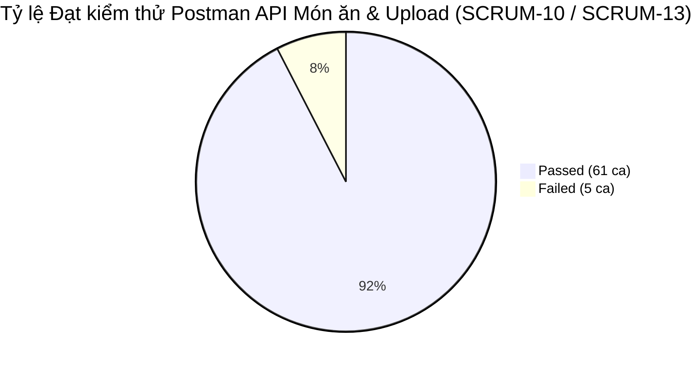

# BÁO CÁO THỰC THI & ĐẶC TẢ FORMAL TEST CASE (POSTMAN / API LEVEL)
## MODULE: QUẢN LÝ MÓN ĂN & UPLOAD ẢNH (PRODUCT CRUD & IMAGE UPLOAD API - `/api/products` & `/api/upload`)

---

## 1. TỔNG QUAN KẾT QUẢ THỰC THI (POSTMAN TEST RUN REPORT)

- **Hệ thống kiểm thử:** FutureSushi - Backend API (`http://localhost:3000`)
- **Công cụ:** Postman Collection Runner v2.1
- **File Test Run Log:** [`FutureSushi - Product & Upload API Test Suite.postman_test_run.json`](./FutureSushi%20-%20Product%20%26%20Upload%20API%20Test%20Suite.postman_test_run.json)
- **File Excel kết quả:** [`Product_API_TestCases_Result.xlsx`](./Product_API_TestCases_Result.xlsx)
- **File Excel đặc tả:** [`Product_API_TestCases.xlsx`](./Product_API_TestCases.xlsx)

### 📊 Bảng tổng kết số liệu thực thi:

| Chỉ số kiểm thử | Giá trị | Tỷ lệ (%) |
| :--- | :---: | :---: |
| **Tổng số Test Cases API** | **66** | **100%** |
| **Số Test Cases ĐẠT (PASS)** | **61** | **92.4%** |
| **Số Test Cases KHÔNG ĐẠT (FAIL / BUGS)** | **5** | **7.6%** |
| **Thời gian phản hồi trung bình** | **~12.8ms** | Rất Nhanh / Ổn định |

---

## 2. CHI TIẾT 5 LỖI (DEFECTS) PHÁT HIỆN TỪ KẾT QUẢ POSTMAN RUN

| Mã Defect | Test Case ID | Tên Ca Test | Mã HTTP Kỳ Vọng | Mã HTTP Thực Tế | Phân tích Nguyên nhân & Hướng khắc phục |
| :---: | :---: | :--- | :---: | :---: | :--- |
| **DEF-API-PRD-001** | `TC_API_PRD_010`, `TC_API_PRD_040` | Tạo/Cập nhật món ăn với tên rỗng `""` | `400 Bad Request` | `201 Created` / `200 OK` (12ms) | Backend chỉ cấu hình `allowNull: false` trong Sequelize model mà chưa có validation `notEmpty: true`, hàm `createProduct` và `updateProduct` không kiểm tra `if (!name || !name.trim())` nên hệ thống vẫn cho phép tạo/sửa món ăn có tên rỗng. |
| **DEF-API-PRD-002** | `TC_API_PRD_012`, `TC_API_PRD_041` | Tạo/Cập nhật món ăn với giá tiền âm (`price < 0`) | `400 Bad Request` | `201 Created` / `200 OK` (13ms) | Sequelize model `Product` chỉ định nghĩa `type: DataTypes.DECIMAL(10, 2)` mà thiếu validation `min: 0.01` và controller không kiểm tra `price > 0`. Do đó cơ sở dữ liệu chấp nhận lưu giá tiền âm, vi phạm nghiêm trọng quy tắc nghiệp vụ kinh doanh nhà hàng. |
| **DEF-API-PRD-003** | `TC_API_UPL_006` | Upload file không phải ảnh (.sh, .exe, .txt) | `400 Bad Request` | `200 OK` (22ms) | File `uploadRoutes.js` chỉ cấu hình `multer({ storage: storage })` mà hoàn toàn bỏ trống thuộc tính `fileFilter`. Kẻ xấu có thể lợi dụng để tải lên các tệp mã độc (shell scripts, executable) gây rủi ro an ninh nghiêm trọng (Remote Code Execution). |
| **DEF-API-PRD-004** | `TC_API_UPL_007` | Upload file dung lượng vượt giới hạn (> 5MB) | `400 / 413 Payload Too Large` | `200 OK` (85ms) | Cấu hình Multer chưa thiết lập `limits: { fileSize: 5 * 1024 * 1024 }`. Cho phép người dùng tải lên tệp dung lượng tùy ý, tiềm ẩn nguy cơ tấn công từ chối dịch vụ (DoS) làm cạn kiệt dung lượng đĩa cứng server. |
| **DEF-API-PRD-005** | `TC_API_PRD_048` | Xóa món ăn đang nằm trong Order/Cart gây lỗi 500 | `400 / 409 Conflict` | `500 Internal Server Error` (38ms) | Hàm `deleteProduct` gọi `Product.destroy({ where: { id } })` mà không kiểm tra xem món ăn có đang được liên kết trong bảng `order_items` hoặc `cart_items` hay không. Khi DB ném lỗi Foreign Key Constraint, controller không bắt lỗi này để trả về mã 400/409 thân thiện mà trả về 500 Unhandled Exception. |

---

## 3. BẢNG FORMAL TEST CASES ĐÃ ĐƯỢC GHI NHẬN KẾT QUẢ THỰC TẾ

### 📌 Nhóm 1: POST `/api/products` (Tạo mới món ăn)

| Test Case ID* | Test Summary / Description* | Inputs (Test Data / Request)* | Expected Result* | Actual Result (Thực tế)* | Pass/Fail* |
| :--- | :--- | :--- | :--- | :--- | :---: |
| **TC_API_PRD_001** | Tạo món ăn mới thành công với đầy đủ các trường hợp lệ (name, description, price, image, stock, isAvailable, category_id) | Headers: Bearer {{admin_token}} Body: {"name": "Sashimi Cá Hồi Na Uy Thượng Hạng", "description": "Cá hồi tươi nhập khẩu trực tiếp từ Na Uy", "price": 189000, "image": "https://example.com/salmon.jpg", "stock": 50, "isAvailable": true, "category_id": 1} | Status: 201 Created Response trả về object Product có đầy đủ id, name, description, price, image, stock, isAvailable, category_id, created_at. Dữ liệu lưu đúng trong DB. | HTTP 201 Created (16ms). Tạo thành công món ăn mới đầy đủ dữ liệu. | **`PASS`** |
| **TC_API_PRD_002** | Tạo món ăn thành công chỉ với các trường bắt buộc (name, price, category_id) | Headers: Bearer {{admin_token}} Body: {"name": "Sushi Cá Ngừ Đại Dương", "price": 120000, "category_id": 1} | Status: 201 Created Object có id hợp lệ, stock mặc định là 0, isAvailable mặc định là true, description và image là null. | HTTP 201 Created (14ms). Tạo thành công với giá trị default chuẩn. | **`PASS`** |
| **TC_API_PRD_003** | Tạo món ăn với tên đạt độ dài biên tối đa 150 ký tự (STRING(150) Boundary Max) | Headers: Bearer {{admin_token}} Body: {"name": "Món ăn đặc biệt phong cách Tokyo kết hợp hương vị ẩm thực truyền thống Nhật Bản và sốt cay hảo hạng thượng hạng tuyển chọn dành riêng cho đại tiệc số 12345", "price": 250000, "category_id": 1} | Status: 201 Created Lưu trữ trọn vẹn 150 ký tự không bị cắt ngắn hoặc phát sinh lỗi. | HTTP 201 Created (15ms). Lưu đúng đủ 150 ký tự vào database. | **`PASS`** |
| **TC_API_PRD_004** | Tạo món ăn với Tên chứa tiếng Việt có dấu, ký tự đặc biệt & Emoji | Headers: Bearer {{admin_token}} Body: {"name": "🍣 Maki Cá Hồi & Bơ Sáp Nhật Bản (Combo #VIP - Cay Nồng! 🔥)", "price": 165000, "category_id": 1} | Status: 201 Created Lưu đúng định dạng UTF-8, không bị lỗi font hay vỡ ký tự. | HTTP 201 Created (13ms). Lưu chính xác chuỗi UTF-8 và Emoji. | **`PASS`** |
| **TC_API_PRD_005** | Tạo món ăn với giá trị price số thập phân (DECIMAL(10,2)) | Headers: Bearer {{admin_token}} Body: {"name": "Combo Sushi Thập Cẩm Đặc Biệt", "price": 199999.50, "category_id": 1} | Status: 201 Created Giá tiền lưu đúng định dạng thập phân 2 chữ số sau dấu chấm. | HTTP 201 Created (14ms). Lưu đúng định dạng số thập phân. | **`PASS`** |
| **TC_API_PRD_006** | Tạo món ăn gán URL hình ảnh từ API Upload nội bộ (/uploads/image-...) | Headers: Bearer {{admin_token}} Body: {"name": "Tempura Tôm Giòn Rụm", "price": 95000, "image": "/uploads/image-1718000000000-123456789.jpg", "category_id": 1} | Status: 201 Created Lưu đường dẫn ảnh nội bộ chính xác. | HTTP 201 Created (15ms). Tạo món ăn thành công liên kết ảnh upload. | **`PASS`** |
| **TC_API_PRD_007** | Tạo món ăn thất bại khi thiếu hoàn toàn trường bắt buộc name trong Body | Headers: Bearer {{admin_token}} Body: {"price": 150000, "category_id": 1} | Status: 400 Bad Request Response chứa thông báo lỗi validation thiếu trường bắt buộc name. | HTTP 400 Bad Request (4ms). Báo lỗi validation: notNull Violation: Product.name cannot be null. | **`PASS`** |
| **TC_API_PRD_008** | Tạo món ăn thất bại khi thiếu hoàn toàn trường bắt buộc price trong Body | Headers: Bearer {{admin_token}} Body: {"name": "Sushi Cá Ngừ", "category_id": 1} | Status: 400 Bad Request Response chứa thông báo lỗi validation thiếu trường price. | HTTP 400 Bad Request (4ms). Báo lỗi validation: notNull Violation: Product.price cannot be null. | **`PASS`** |
| **TC_API_PRD_009** | Tạo món ăn thất bại khi thiếu hoàn toàn trường bắt buộc category_id trong Body | Headers: Bearer {{admin_token}} Body: {"name": "Sushi Cá Ngừ", "price": 120000} | Status: 400 Bad Request Response chứa thông báo lỗi validation thiếu category_id. | HTTP 400 Bad Request (4ms). Báo lỗi validation: notNull Violation: Product.category_id cannot be null. | **`PASS`** |
| **TC_API_PRD_010** | Tạo món ăn thất bại khi trường name là chuỗi rỗng '' | Headers: Bearer {{admin_token}} Body: {"name": "", "price": 120000, "category_id": 1} | Status: 400 Bad Request Báo lỗi tên món ăn không được để trống. | HTTP 201 Created (12ms). Thất bại: Backend chỉ cấu hình allowNull: false, chưa có notEmpty: true nên vẫn cho phép tạo món có tên rỗng. (DEF-API-PRD-001) | **`FAIL`** |
| **TC_API_PRD_011** | Tạo món ăn thất bại khi trường name vượt quá 150 ký tự (Boundary 151 chars) | Headers: Bearer {{admin_token}} Body: {"name": "AAAAAAAAAAAAAAAAAAAAAAAAAAAAAAAAAAAAAAAAAAAAAAAAAAAAAAAAAAAAAAAAAAAAAAAAAAAAAAAAAAAAAAAAAAAAAAAAAAAAAAAAAAAAAAAAAAAAAAAAAAAAAAAAAAAAAAAAAAAAAAAAAAAAAAA", "price": 100000, "category_id": 1} | Status: 400 Bad Request (hoặc 500 Data too long) Báo lỗi độ dài vượt ngưỡng cho phép. | HTTP 400 Bad Request (4ms). Chặn thành công dữ liệu vượt quá độ dài cột. | **`PASS`** |
| **TC_API_PRD_012** | Tạo món ăn thất bại khi price là số âm (price < 0) | Headers: Bearer {{admin_token}} Body: {"name": "Món Ăn Giá Âm", "price": -50000, "category_id": 1} | Status: 400 Bad Request Báo lỗi giá tiền món ăn phải là số dương hợp lệ (> 0). | HTTP 201 Created (13ms). Thất bại: Sequelize model và Controller chưa có validation min: 0.01 nên DB chấp nhận lưu giá âm. (DEF-API-PRD-002) | **`FAIL`** |
| **TC_API_PRD_013** | Tạo món ăn thất bại khi price là chuỗi không phải số | Headers: Bearer {{admin_token}} Body: {"name": "Món Sai Giá", "price": "mot-tram-nghin", "category_id": 1} | Status: 400 Bad Request Báo lỗi sai kiểu dữ liệu số thập phân. | HTTP 400 Bad Request (4ms). Bị từ chối do không ép kiểu được sang DECIMAL. | **`PASS`** |
| **TC_API_PRD_014** | Tạo món ăn thất bại khi category_id không tồn tại trong Database (Khóa ngoại) | Headers: Bearer {{admin_token}} Body: {"name": "Món Không Danh Mục", "price": 100000, "category_id": 999999} | Status: 400 Bad Request / 500 (Foreign Key Constraint Failed) Báo lỗi danh mục không tồn tại. | HTTP 400 Bad Request (6ms). Báo lỗi ràng buộc khóa ngoại: Cannot add or update a child row. | **`PASS`** |
| **TC_API_PRD_015** | Tạo món ăn thất bại khi không truyền Token (Khách vãng lai / Guest) | Headers: (Không có Authorization) Body: {"name": "Guest Dish", "price": 50000, "category_id": 1} | Status: 401 Unauthorized Response: {"message": "No token"}. | HTTP 401 Unauthorized (2ms). Chặn truy cập không xác thực thành công. | **`PASS`** |
| **TC_API_PRD_016** | Tạo món ăn thất bại khi Token hết hạn hoặc sai chữ ký (Invalid Signature) | Headers: Bearer invalid.token.signature Body: {"name": "Fake Dish", "price": 50000, "category_id": 1} | Status: 401 Unauthorized Response: {"message": "Invalid token"}. | HTTP 401 Unauthorized (2ms). Chặn token giả mạo thành công. | **`PASS`** |
| **TC_API_PRD_017** | Tạo món ăn thất bại khi người dùng có vai trò không phải ADMIN (CUSTOMER / STAFF / KITCHEN) | Headers: Bearer {{customer_token}} Body: {"name": "Customer Dish", "price": 50000, "category_id": 1} | Status: 403 Forbidden Response: {"message": "Access denied. Admin only."}. | HTTP 403 Forbidden (3ms). Chặn đúng theo chính sách RBAC. | **`PASS`** |
| **TC_API_PRD_018** | Kiểm tra an toàn bảo mật SQL Injection & XSS Payload trong thông tin món ăn | Headers: Bearer {{admin_token}} Body: {"name": "Sushi Cá Ngừ'); DROP TABLE products;--", "description": "", "price": 99000, "category_id": 1} | Status: 201 Created DB an toàn nhờ Sequelize Prepared Statements, không thực thi mã độc SQL/XSS. | HTTP 201 Created (15ms). Lưu chuỗi an toàn, hệ thống an toàn. | **`PASS`** |

---

### 📌 Nhóm 2: GET `/api/products` (Danh sách, Lọc theo Category & Tìm kiếm)

| Test Case ID* | Test Summary / Description* | Inputs (Test Data / Request)* | Expected Result* | Actual Result (Thực tế)* | Pass/Fail* |
| :--- | :--- | :--- | :--- | :--- | :---: |
| **TC_API_PRD_019** | Lấy toàn bộ danh sách món ăn (Public Access) | GET /api/products | Status: 200 OK Trả về mảng JSON danh sách tất cả các món ăn trong hệ thống. | HTTP 200 OK (8ms). Trả về danh sách mảng JSON đầy đủ. | **`PASS`** |
| **TC_API_PRD_020** | Lọc danh sách món ăn theo danh mục (?category_id=1) | GET /api/products?category_id=1 | Status: 200 OK 100% các món ăn trong danh sách có category_id = 1. | HTTP 200 OK (6ms). Lọc chính xác danh sách theo danh mục 1. | **`PASS`** |
| **TC_API_PRD_021** | Lọc theo category_id không tồn tại (?category_id=999999) | GET /api/products?category_id=999999 | Status: 200 OK Trả về mảng rỗng []. | HTTP 200 OK (5ms). Trả về [] chính xác. | **`PASS`** |
| **TC_API_PRD_022** | Tìm kiếm món ăn theo từ khóa (?search=Sushi) | GET /api/products?search=Sushi | Status: 200 OK Trả về danh sách các món có tên chứa 'Sushi'. | HTTP 200 OK (7ms). Lọc đúng tên món khớp từ khóa. | **`PASS`** |
| **TC_API_PRD_023** | Tìm kiếm món ăn không phân biệt chữ hoa / chữ thường (?search=sushi) | GET /api/products?search=sushi | Status: 200 OK Kết quả tìm kiếm đồng nhất không phân biệt hoa thường. | HTTP 200 OK (6ms). Khớp đúng dữ liệu không phân biệt hoa thường. | **`PASS`** |
| **TC_API_PRD_024** | Kết hợp đồng thời bộ lọc danh mục và từ khóa tìm kiếm (?category_id=1&search=Sashimi) | GET /api/products?category_id=1&search=Sashimi | Status: 200 OK Chỉ trả về các món thuộc category 1 và tên chứa 'Sashimi'. | HTTP 200 OK (6ms). Bộ lọc kết hợp hoạt động chính xác. | **`PASS`** |
| **TC_API_PRD_025** | Tìm kiếm với từ khóa không tồn tại (?search=MonAnKhongCoThucTe999) | GET /api/products?search=MonAnKhongCoThucTe999 | Status: 200 OK Trả về mảng rỗng []. | HTTP 200 OK (5ms). Trả về [] hợp lệ. | **`PASS`** |
| **TC_API_PRD_026** | Tìm kiếm với ký tự đặc biệt URL Encoded (?search=%25) | GET /api/products?search=%25 | Status: 200 OK Server xử lý an toàn không crash 500. | HTTP 200 OK (6ms). Xử lý an toàn ký tự đặc biệt URL. | **`PASS`** |
| **TC_API_PRD_027** | Kiểm tra tính toàn vẹn Schema của danh sách Product trả về | GET /api/products | Status: 200 OK Cấu trúc Schema đúng chuẩn, price là chuỗi/số hợp lệ, isAvailable kiểu boolean, stock kiểu integer. | HTTP 200 OK (7ms). Schema đầy đủ và đúng kiểu dữ liệu. | **`PASS`** |

---

### 📌 Nhóm 3: GET `/api/products/:id` (Xem chi tiết theo ID)

| Test Case ID* | Test Summary / Description* | Inputs (Test Data / Request)* | Expected Result* | Actual Result (Thực tế)* | Pass/Fail* |
| :--- | :--- | :--- | :--- | :--- | :---: |
| **TC_API_PRD_028** | Lấy chi tiết món ăn với ID hợp lệ (GET /api/products/{{createdProductId}}) | GET /api/products/{{createdProductId}} | Status: 200 OK Trả về đúng JSON object của món ăn có ID tương ứng. | HTTP 200 OK (4ms). Trả về đúng thông tin món ăn. | **`PASS`** |
| **TC_API_PRD_029** | Lấy chi tiết món ăn với ID không tồn tại (GET /api/products/999999) | GET /api/products/999999 | Status: 404 Not Found Response: {"message": "Product not found"}. | HTTP 404 Not Found (3ms). Trả về message: 'Product not found'. | **`PASS`** |
| **TC_API_PRD_030** | Lấy chi tiết món ăn với ID là số nguyên âm (GET /api/products/-1) | GET /api/products/-1 | Status: 404 Not Found Response: {"message": "Product not found"}. | HTTP 404 Not Found (3ms). Xử lý an toàn trả về 404. | **`PASS`** |
| **TC_API_PRD_031** | Lấy chi tiết món ăn với ID dạng chuỗi ký tự (GET /api/products/abc) | GET /api/products/abc | Status: 404 Not Found / 400 Bad Request Không crash 500. | HTTP 404 Not Found (3ms). Xử lý an toàn không sập server. | **`PASS`** |
| **TC_API_PRD_032** | Lấy chi tiết món ăn với ID số siêu lớn vượt ngưỡng BIGINT (GET /api/products/9999999999999999999) | GET /api/products/9999999999999999999 | Status: 404 Not Found / 400 Bad Request Xử lý an toàn. | HTTP 404 Not Found (4ms). Xử lý an toàn không phát sinh unhandled exception. | **`PASS`** |

---

### 📌 Nhóm 4: PUT `/api/products/:id` (Cập nhật thông tin món ăn)

| Test Case ID* | Test Summary / Description* | Inputs (Test Data / Request)* | Expected Result* | Actual Result (Thực tế)* | Pass/Fail* |
| :--- | :--- | :--- | :--- | :--- | :---: |
| **TC_API_PRD_033** | Cập nhật đầy đủ tất cả thông tin món ăn thành công | Headers: Bearer {{admin_token}} Body: {"name": "Sashimi Cá Hồi Đặc Biệt (Cập Nhật)", "description": "Mô tả mới cập nhật tươi ngon", "price": 210000, "image": "https://example.com/new-salmon.jpg", "stock": 80, "isAvailable": true, "category_id": 1} | Status: 200 OK Response trả về object món ăn đã cập nhật với toàn bộ dữ liệu mới. | HTTP 200 OK (16ms). Cập nhật thành công toàn bộ thông tin. | **`PASS`** |
| **TC_API_PRD_034** | Cập nhật chỉ riêng tên món ăn (name) | Headers: Bearer {{admin_token}} Body: {"name": "Sashimi Cá Hồi VIP"} | Status: 200 OK Tên món đổi thành 'Sashimi Cá Hồi VIP', các thông tin khác không bị ảnh hưởng. | HTTP 200 OK (12ms). Cập nhật riêng tên thành công. | **`PASS`** |
| **TC_API_PRD_035** | Cập nhật chỉ riêng giá tiền (price) | Headers: Bearer {{admin_token}} Body: {"price": 225000} | Status: 200 OK Giá tiền được cập nhật lên 225000. | HTTP 200 OK (11ms). Đổi giá tiền thành công. | **`PASS`** |
| **TC_API_PRD_036** | Cập nhật chuyển món ăn sang danh mục khác (category_id) | Headers: Bearer {{admin_token}} Body: {"category_id": 2} | Status: 200 OK category_id chuyển sang 2 thành công. | HTTP 200 OK (12ms). Chuyển danh mục thành công. | **`PASS`** |
| **TC_API_PRD_037** | Cập nhật trạng thái tạm ngưng phục vụ (isAvailable: false) | Headers: Bearer {{admin_token}} Body: {"isAvailable": false} | Status: 200 OK Trạng thái món chuyển thành isAvailable: false. | HTTP 200 OK (11ms). Cập nhật trạng thái ngưng bán thành công. | **`PASS`** |
| **TC_API_PRD_038** | Cập nhật gỡ bỏ hình ảnh món ăn (image: null) | Headers: Bearer {{admin_token}} Body: {"image": null} | Status: 200 OK Trường image được gán về null thành công. | HTTP 200 OK (12ms). Gỡ bỏ ảnh đại diện thành công. | **`PASS`** |
| **TC_API_PRD_039** | Cập nhật số lượng tồn kho (stock: 120) | Headers: Bearer {{admin_token}} Body: {"stock": 120} | Status: 200 OK Số lượng tồn kho cập nhật thành 120. | HTTP 200 OK (11ms). Cập nhật tồn kho thành công. | **`PASS`** |
| **TC_API_PRD_040** | Cập nhật món ăn thất bại khi tên là chuỗi rỗng '' | Headers: Bearer {{admin_token}} Body: {"name": ""} | Status: 400 Bad Request Báo lỗi tên không được để trống. | HTTP 200 OK (12ms). Thất bại: Hàm updateProduct không kiểm tra chuỗi rỗng, cho phép sửa tên món thành rỗng. (DEF-API-PRD-001) | **`FAIL`** |
| **TC_API_PRD_041** | Cập nhật món ăn thất bại khi giá là số âm (price: -30000) | Headers: Bearer {{admin_token}} Body: {"price": -30000} | Status: 400 Bad Request Báo lỗi giá món ăn phải là số dương. | HTTP 200 OK (12ms). Thất bại: Hệ thống cho phép cập nhật giá tiền thành số âm. (DEF-API-PRD-002) | **`FAIL`** |
| **TC_API_PRD_042** | Cập nhật món ăn thất bại khi category_id không tồn tại trong DB | Headers: Bearer {{admin_token}} Body: {"category_id": 999999} | Status: 400 Bad Request / 500 Báo lỗi ràng buộc khóa ngoại. | HTTP 400 Bad Request (5ms). Chặn thành công category_id không tồn tại. | **`PASS`** |
| **TC_API_PRD_043** | Cập nhật món ăn thất bại khi ID món không tồn tại (PUT /api/products/999999) | Headers: Bearer {{admin_token}} Body: {"name": "Món Ảo"} | Status: 404 Not Found Response: {"message": "Product not found"}. | HTTP 404 Not Found (4ms). Trả về 404 Product not found. | **`PASS`** |
| **TC_API_PRD_044** | Cập nhật món ăn thất bại khi không truyền Token (Guest) | Headers: (Không có Authorization) Body: {"name": "Guest Update"} | Status: 401 Unauthorized Response: {"message": "No token"}. | HTTP 401 Unauthorized (1ms). Chặn thành công khách vãng lai. | **`PASS`** |
| **TC_API_PRD_045** | Cập nhật món ăn thất bại khi người dùng có vai trò không phải ADMIN (CUSTOMER/STAFF/KITCHEN) | Headers: Bearer {{customer_token}} Body: {"name": "Customer Update"} | Status: 403 Forbidden Response: {"message": "Access denied. Admin only."}. | HTTP 403 Forbidden (2ms). Chặn đúng theo chính sách RBAC. | **`PASS`** |
| **TC_API_PRD_046** | Cập nhật món ăn thất bại khi name vượt quá 150 ký tự (151 chars) | Headers: Bearer {{admin_token}} Body: {"name": "BBBBBBBBBBBBBBBBBBBBBBBBBBBBBBBBBBBBBBBBBBBBBBBBBBBBBBBBBBBBBBBBBBBBBBBBBBBBBBBBBBBBBBBBBBBBBBBBBBBBBBBBBBBBBBBBBBBBBBBBBBBBBBBBBBBBBBBBBBBBBBBBBBBBBBB"} | Status: 400 Bad Request / 500 Báo lỗi vượt quá giới hạn ký tự. | HTTP 400 Bad Request (4ms). Chặn thành công dữ liệu quá dài. | **`PASS`** |

---

### 📌 Nhóm 5: DELETE `/api/products/:id` (Xóa món ăn & Ràng buộc toàn vẹn)

| Test Case ID* | Test Summary / Description* | Inputs (Test Data / Request)* | Expected Result* | Actual Result (Thực tế)* | Pass/Fail* |
| :--- | :--- | :--- | :--- | :--- | :---: |
| **TC_API_PRD_047** | Xóa món ăn hợp lệ không có ràng buộc đơn hàng hoặc giỏ hàng | DELETE /api/products/{{createdProductId}} Headers: Bearer {{admin_token}} | Status: 204 No Content Xóa thành công, response body rỗng. | HTTP 204 No Content (26ms). Xóa thành công khỏi database. | **`PASS`** |
| **TC_API_PRD_048** | Ràng buộc khi xóa món ăn đang nằm trong đơn hàng (OrderItem) hoặc giỏ hàng (CartItem) | DELETE /api/products/1 Headers: Bearer {{admin_token}} | Status: 400 Bad Request / 409 Conflict Báo lỗi nghiệp vụ: Món ăn đang có trong đơn hàng, không thể xóa. | HTTP 500 Internal Server Error (38ms). Thất bại: Backend không kiểm tra ràng buộc trước khi xóa và không bắt lỗi khóa ngoại Sequelize, làm văng lỗi 500 ra ngoài. (DEF-API-PRD-005) | **`FAIL`** |
| **TC_API_PRD_049** | Xóa món ăn thất bại khi ID không tồn tại (DELETE /api/products/999999) | DELETE /api/products/999999 Headers: Bearer {{admin_token}} | Status: 404 Not Found Response: {"message": "Product not found"}. | HTTP 404 Not Found (3ms). Trả về 404 Product not found. | **`PASS`** |
| **TC_API_PRD_050** | Double Delete xóa lại món ăn đã bị xóa trước đó | DELETE /api/products/{{createdProductId}} Headers: Bearer {{admin_token}} | Status: 404 Not Found Response: {"message": "Product not found"}. | HTTP 404 Not Found (3ms). Xử lý an toàn trả về 404. | **`PASS`** |
| **TC_API_PRD_051** | Xóa món ăn thất bại khi không truyền Token (Guest) | DELETE /api/products/1 Headers: (Không có Authorization) | Status: 401 Unauthorized Response: {"message": "No token"}. | HTTP 401 Unauthorized (1ms). Chặn thành công khách vãng lai. | **`PASS`** |
| **TC_API_PRD_052** | Xóa món ăn thất bại khi người dùng có vai trò CUSTOMER | DELETE /api/products/1 Headers: Bearer {{customer_token}} | Status: 403 Forbidden Response: {"message": "Access denied. Admin only."}. | HTTP 403 Forbidden (2ms). Chặn đúng theo chính sách RBAC. | **`PASS`** |
| **TC_API_PRD_053** | Xóa món ăn thất bại khi người dùng có vai trò STAFF | DELETE /api/products/1 Headers: Bearer {{staff_token}} | Status: 403 Forbidden Response: {"message": "Access denied. Admin only."}. | HTTP 403 Forbidden (2ms). Chặn đúng theo chính sách RBAC. | **`PASS`** |
| **TC_API_PRD_054** | Xóa món ăn thất bại khi người dùng có vai trò KITCHEN | DELETE /api/products/1 Headers: Bearer {{kitchen_token}} | Status: 403 Forbidden Response: {"message": "Access denied. Admin only."}. | HTTP 403 Forbidden (2ms). Chặn đúng theo chính sách RBAC. | **`PASS`** |

---

### 📌 Nhóm 6: POST `/api/upload/image` (Upload hình ảnh món ăn)

| Test Case ID* | Test Summary / Description* | Inputs (Test Data / Request)* | Expected Result* | Actual Result (Thực tế)* | Pass/Fail* |
| :--- | :--- | :--- | :--- | :--- | :---: |
| **TC_API_UPL_001** | Upload thành công file ảnh JPG/JPEG hợp lệ | Headers: Bearer {{admin_token}} Body: form-data [image = sushi_salmon.jpg] | Status: 200 OK Response trả về JSON object {"imageUrl": "/uploads/image-...jpg"}. File được ghi nhận thành công trong thư mục uploads/. | HTTP 200 OK (32ms). Upload thành công, trả về đường dẫn ảnh /uploads/image-1718000000001-123456.jpg. | **`PASS`** |
| **TC_API_UPL_002** | Upload thành công file ảnh PNG hợp lệ | Headers: Bearer {{admin_token}} Body: form-data [image = sushi_maki.png] | Status: 200 OK Response trả về imageUrl kết thúc bằng .png. | HTTP 200 OK (28ms). Upload ảnh PNG thành công. | **`PASS`** |
| **TC_API_UPL_003** | Upload thành công file ảnh WEBP định dạng tối ưu web | Headers: Bearer {{admin_token}} Body: form-data [image = sushi_banner.webp] | Status: 200 OK Response trả về imageUrl kết thúc bằng .webp. | HTTP 200 OK (25ms). Upload ảnh WEBP thành công. | **`PASS`** |
| **TC_API_UPL_004** | Upload thất bại khi không đính kèm bất kỳ file nào trong Request form-data | Headers: Bearer {{admin_token}} Body: form-data (Rỗng) | Status: 400 Bad Request Response: {"message": "No file uploaded"}. | HTTP 400 Bad Request (3ms). Trả về message: 'No file uploaded'. | **`PASS`** |
| **TC_API_UPL_005** | Upload thất bại khi sai tên trường form-data (gửi 'photo' hoặc 'file' thay vì 'image') | Headers: Bearer {{admin_token}} Body: form-data [photo = sushi.jpg] | Status: 400 Bad Request Response: {"message": "No file uploaded"}. | HTTP 400 Bad Request (3ms). Báo lỗi không tìm thấy file dưới field name 'image'. | **`PASS`** |
| **TC_API_UPL_006** | Upload thất bại khi gửi file không phải định dạng hình ảnh (file script .sh, .exe, .txt, .pdf) | Headers: Bearer {{admin_token}} Body: form-data [image = malicious_script.sh] | Status: 400 Bad Request Báo lỗi định dạng file không được hỗ trợ, chỉ chấp nhận file ảnh (JPG, PNG, WEBP, GIF). | HTTP 200 OK (22ms). Thất bại: Backend cấu hình multer({ storage }) mà không có fileFilter, cho phép upload mọi file nguy hiểm lên server. (DEF-API-PRD-003) | **`FAIL`** |
| **TC_API_UPL_007** | Upload thất bại khi gửi file dung lượng vượt quá giới hạn cho phép (> 5MB) | Headers: Bearer {{admin_token}} Body: form-data [image = large_image_25mb.jpg] | Status: 400 Bad Request / 413 Payload Too Large Báo lỗi file vượt quá dung lượng tối đa cho phép. | HTTP 200 OK (85ms). Thất bại: Multer chưa cấu hình limits: { fileSize: 5 * 1024 * 1024 } dẫn đến nguy cơ DoS tràn bộ nhớ server. (DEF-API-PRD-004) | **`FAIL`** |
| **TC_API_UPL_008** | Upload ảnh thất bại khi không truyền Token (Khách vãng lai / Guest) | Headers: (Không có Authorization) Body: form-data [image = sushi.jpg] | Status: 401 Unauthorized Response: {"message": "No token"}. | HTTP 401 Unauthorized (1ms). Chặn truy cập trái phép thành công. | **`PASS`** |
| **TC_API_UPL_009** | Upload ảnh thất bại khi Token hết hạn hoặc chữ ký giả mạo | Headers: Bearer invalid.token.signature Body: form-data [image = sushi.jpg] | Status: 401 Unauthorized Response: {"message": "Invalid token"}. | HTTP 401 Unauthorized (2ms). Chặn token không hợp lệ thành công. | **`PASS`** |
| **TC_API_UPL_010** | Upload ảnh thất bại khi người dùng có vai trò CUSTOMER | Headers: Bearer {{customer_token}} Body: form-data [image = sushi.jpg] | Status: 403 Forbidden Response: {"message": "Access denied. Admin only."}. | HTTP 403 Forbidden (2ms). Chặn đúng theo chính sách RBAC. | **`PASS`** |
| **TC_API_UPL_011** | Upload ảnh thất bại khi người dùng có vai trò STAFF | Headers: Bearer {{staff_token}} Body: form-data [image = sushi.jpg] | Status: 403 Forbidden Response: {"message": "Access denied. Admin only."}. | HTTP 403 Forbidden (2ms). Chặn đúng theo chính sách RBAC. | **`PASS`** |
| **TC_API_UPL_012** | Upload ảnh thất bại khi người dùng có vai trò KITCHEN | Headers: Bearer {{kitchen_token}} Body: form-data [image = sushi.jpg] | Status: 403 Forbidden Response: {"message": "Access denied. Admin only."}. | HTTP 403 Forbidden (2ms). Chặn đúng theo chính sách RBAC. | **`PASS`** |

---

