# MA TRẬN KIỂM THỬ GIÁ TRỊ BIÊN (BOUNDARY VALUE ANALYSIS - BVA TEST MATRIX)
## MODULE: XÁC THỰC & QUẢN LÝ NGƯỜI DÙNG (AUTHENTICATION & USER MANAGEMENT API)
### HỆ THỐNG: FUTURESUSHI BACKEND (`/api/auth` & `/api/users`)

---

## 1. TỔNG QUAN & PHƯƠNG PHÁP LUẬN BVA (METHODOLOGY)

### 1.1 Khái niệm & Kỹ thuật áp dụng
**Phân tích giá trị biên (Boundary Value Analysis - BVA)** là kỹ thuật thiết kế kiểm thử hộp đen (Black-box Testing) dựa trên giả định rằng các lỗi phần mềm thường tập trung tại ranh giới của các phân vùng tương đương (Equivalence Partitions) hơn là ở trung tâm.

Trong bộ ma trận này, hệ thống áp dụng kỹ thuật kiểm thử biên mở rộng:
- **2-Value BVA**: Kiểm tra tại biên ($B$) và ngoài biên lân cận ($B-1, B+1$).
- **3-Value BVA (Robustness Testing)**: Kiểm tra $Min-1, Min, Min+1, Nominal, Max-1, Max, Max+1$.
- **Biên kiểu dữ liệu CSDL (Database Schema Boundary)**: Dựa trên schema `VARCHAR(40)`, `VARCHAR(100)`, `VARCHAR(20)`, `VARCHAR(255)`, `INTEGER` (Signed 32-bit), `BIGINT` (64-bit).
- **Biên logic nghiệp vụ (Business Rules Boundary)**: Ràng buộc độ dài username (3 - 40 ký tự), password (6 - 255 ký tự), số điện thoại VN (10 số), điểm thưởng (points >= 0), enum role/status.

```mermaid
graph LR
    subgraph "Vùng Không Hợp Lệ (Dưới Biên)"
        A["Min - 1 (Invalid)"]
    end
    subgraph "VÙNG HỢP LỆ (VALID PARTITION)"
        B["Min (Valid Biên Dưới)"]
        C["Min + 1 (Valid)"]
        D["Nominal (Giá trị đại diện)"]
        E["Max - 1 (Valid)"]
        F["Max (Valid Biên Trên)"]
    end
    subgraph "Vùng Không Hợp Lệ (Vượt Biên)"
        G["Max + 1 (Invalid)"]
    end
    A --> B --> C --> D --> E --> F --> G
    style B fill:#d4edda,stroke:#28a745,color:#155724
    style C fill:#d4edda,stroke:#28a745,color:#155724
    style D fill:#d1ecf1,stroke:#17a2b8,color:#0c5460
    style E fill:#d4edda,stroke:#28a745,color:#155724
    style F fill:#d4edda,stroke:#28a745,color:#155724
    style A fill:#f8d7da,stroke:#dc3545,color:#721c24
    style G fill:#f8d7da,stroke:#dc3545,color:#721c24
```

---

## 2. BẢNG PHÂN TÍCH RÀNG BUỘC BIÊN CHO TỪNG THUỘC TÍNH (INPUT BVA SPECIFICATIONS)

| Thuộc tính (Field) | Kiểu DL (Data Type) | Ràng buộc DB / SRS | Min - 1 (Invalid) | Min (Valid) | Min + 1 (Valid) | Max - 1 (Valid) | Max (Valid) | Max + 1 (Invalid) | Giá trị đặc biệt / Biên rỗng |
| :--- | :--- | :--- | :---: | :---: | :---: | :---: | :---: | :---: | :--- |
| **`fullName`** | `VARCHAR(100)` | NOT NULL, 1 - 100 chars | 0 ký tự (`""`) | 1 ký tự (`"A"`) | 2 ký tự (`"An"`) | 99 ký tự | 100 ký tự | 101 ký tự | `null`, `undefined`, khoảng trắng (`"   "`), Unicode UTF-8 |
| **`username`** | `VARCHAR(40)` | NOT NULL, UNIQUE, 3 - 40 chars | 2 ký tự (`"us"`) | 3 ký tự (`"usr"`) | 4 ký tự (`"user"`) | 39 ký tự | 40 ký tự | 41 ký tự | `""`, `null`, ký tự đặc biệt, chứa dấu cách |
| **`password`** | `VARCHAR(255)` | NOT NULL, bcrypt hash, 6 - 255 chars | 5 ký tự (`"12345"`) | 6 ký tự (`"123456"`) | 7 ký tự (`"1234567"`) | 254 ký tự | 255 ký tự | 256 ký tự | `""`, `null`, ký tự Unicode, emoji |
| **`phone`** | `VARCHAR(20)` | NOT NULL, UNIQUE, 10 - 20 chars | 9 ký tự (`"091234567"`) | 10 ký tự (`"0912345678"`) | 11 ký tự (`"09123456789"`) | 19 ký tự | 20 ký tự | 21 ký tự | `""`, `null`, chứa chữ cái, chứa ký tự đặc biệt |
| **`email`** | `VARCHAR(100)` | UNIQUE, Nullable, 5 - 100 chars | 4 ký tự (`"a@b."`) | 5 ký tự (`"a@b.c"`) | 6 ký tự (`"ab@b.c"`) | 99 ký tự | 100 ký tự | 101 ký tự | `null`, `""`, thiếu `@`, thiếu domain |
| **`points`** | `INTEGER` | Signed 32-bit, >= 0 | `-1` | `0` | `1` | `2147483646` | `2147483647` (Max INT32) | `2147483648` (Overflow) | `null`, số thập phân (`10.5`), chuỗi (`"abc"`) |
| **`id` (Param)** | `BIGINT` | Primary Key, > 0 | `0`, `-1` | `1` (Min ID) | `2` | `9007199254740990` | `9007199254740991` (MAX_SAFE_INT) | `9007199254740992` | `"abc"`, `null`, số thập phân (`1.5`) |
| **`role`** | `ENUM` | CUSTOMER, STAFF, KITCHEN, ADMIN | N/A | Biên tập giá trị hợp lệ: `["CUSTOMER", "STAFF", "KITCHEN", "ADMIN"]` | N/A | N/A | N/A | Ngoại biên: `"SUPERADMIN"`, `"GUEST"`, `""`, `123` |
| **`status`** | `ENUM` | ACTIVE, BLOCKED | N/A | Biên tập giá trị hợp lệ: `["ACTIVE", "BLOCKED"]` | N/A | N/A | N/A | Ngoại biên: `"INACTIVE"`, `"PENDING"`, `""`, `null` |

---

## 3. MA TRẬN CHI TIẾT TEST CASES BVA TRÊN POSTMAN

### 📌 KHỐI 1: POST `/api/auth/register` (ĐĂNG KÝ TÀI KHOẢN & VALIDATION BIÊN)

| Test Case ID | Mục tiêu kiểm thử | Field / Boundary | Input Payload (Request Body) | Expected HTTP | Expected Response Pattern | Postman PM Test Script Assertion | Ưu tiên |
| :--- | :--- | :--- | :--- | :---: | :--- | :--- | :---: |
| **TC_BVA_REG_001** | Họ tên đạt biên tối thiểu (Min = 1 char) | `fullName` (Min: 1) | `{"fullName": "A", "email": "a_min1_{{$timestamp}}@gmail.com", "phone": "09{{$timestamp8}}", "username": "u_min1_{{$timestamp}}", "password": "Password123@"}` | `201 Created` | `message: "Đăng ký thành công!"`, `user.fullName: "A"` | `pm.response.to.have.status(201); pm.expect(pm.response.json().user.fullName).to.eql("A");` | P1 |
| **TC_BVA_REG_002** | Họ tên cận dưới hợp lệ (Min + 1 = 2 chars) | `fullName` (Min+1: 2) | `{"fullName": "An", "email": "an_min2_{{$timestamp}}@gmail.com", "phone": "09{{$timestamp8}}", "username": "u_min2_{{$timestamp}}", "password": "Password123@"}` | `201 Created` | `message: "Đăng ký thành công!"`, `user.fullName: "An"` | `pm.response.to.have.status(201); pm.expect(pm.response.json().user.fullName).to.eql("An");` | P2 |
| **TC_BVA_REG_003** | Họ tên cận trên hợp lệ (Max - 1 = 99 chars) | `fullName` (Max-1: 99) | `{"fullName": "{{string_99_chars}}", "email": "fn99_{{$timestamp}}@gmail.com", "phone": "09{{$timestamp8}}", "username": "u_fn99_{{$timestamp}}", "password": "Password123@"}` | `201 Created` | `message: "Đăng ký thành công!"`, `user.fullName.length == 99` | `pm.response.to.have.status(201); pm.expect(pm.response.json().user.fullName.length).to.eql(99);` | P2 |
| **TC_BVA_REG_004** | Họ tên đạt biên tối đa (Max = 100 chars) | `fullName` (Max: 100) | `{"fullName": "{{string_100_chars}}", "email": "fn100_{{$timestamp}}@gmail.com", "phone": "09{{$timestamp8}}", "username": "u_fn100_{{$timestamp}}", "password": "Password123@"}` | `201 Created` | `message: "Đăng ký thành công!"`, `user.fullName.length == 100` | `pm.response.to.have.status(201); pm.expect(pm.response.json().user.fullName.length).to.eql(100);` | P1 |
| **TC_BVA_REG_005** | Họ tên vượt biên tối đa (Max + 1 = 101 chars) | `fullName` (Max+1: 101) | `{"fullName": "{{string_101_chars}}", "email": "fn101_{{$timestamp}}@gmail.com", "phone": "09{{$timestamp8}}", "username": "u_fn101_{{$timestamp}}", "password": "Password123@"}` | `400 Bad Request` | `message: /quá dài|tối đa 100 ký tự|lỗi/i` | `pm.expect(pm.response.code).to.be.oneOf([400, 422, 500]);` | P1 |
| **TC_BVA_REG_006** | Họ tên rỗng dưới biên (Min - 1 = 0 chars / Empty `""`) | `fullName` (Min-1: 0) | `{"fullName": "", "email": "fn0_{{$timestamp}}@gmail.com", "phone": "09{{$timestamp8}}", "username": "u_fn0_{{$timestamp}}", "password": "Password123@"}` | `400 Bad Request` | `message: /vui lòng nhập họ tên|không được để trống/i` | `pm.response.to.have.status(400); pm.expect(pm.response.json().message).to.exist;` | P1 |
| **TC_BVA_REG_007** | Username dưới biên tối thiểu (Min - 1 = 2 chars) | `username` (Min-1: 2) | `{"fullName": "Trần Văn B", "email": "u2_{{$timestamp}}@gmail.com", "phone": "09{{$timestamp8}}", "username": "ab", "password": "Password123@"}` | `400 Bad Request` | `message: /tối thiểu 3 ký tự|username không hợp lệ/i` | `pm.expect(pm.response.code).to.be.oneOf([400, 422]);` | P1 |
| **TC_BVA_REG_008** | Username đạt biên tối thiểu (Min = 3 chars) | `username` (Min: 3) | `{"fullName": "Trần Văn B", "email": "u3_{{$timestamp}}@gmail.com", "phone": "09{{$timestamp8}}", "username": "u{{$randomInt}}", "password": "Password123@"}` *(3 chars)* | `201 Created` | `message: "Đăng ký thành công!"`, `user.username.length == 3` | `pm.response.to.have.status(201); pm.expect(pm.response.json().user.username.length).to.eql(3);` | P1 |
| **TC_BVA_REG_009** | Username cận dưới hợp lệ (Min + 1 = 4 chars) | `username` (Min+1: 4) | `{"fullName": "Trần Văn B", "email": "u4_{{$timestamp}}@gmail.com", "phone": "09{{$timestamp8}}", "username": "u{{$randomInt}}a", "password": "Password123@"}` *(4 chars)* | `201 Created` | `message: "Đăng ký thành công!"`, `user.username.length == 4` | `pm.response.to.have.status(201); pm.expect(pm.response.json().user.username.length).to.eql(4);` | P2 |
| **TC_BVA_REG_010** | Username cận trên hợp lệ (Max - 1 = 39 chars) | `username` (Max-1: 39) | `{"fullName": "Lê Văn C", "email": "u39_{{$timestamp}}@gmail.com", "phone": "09{{$timestamp8}}", "username": "{{username_39_chars}}", "password": "Password123@"}` | `201 Created` | `message: "Đăng ký thành công!"`, `user.username.length == 39` | `pm.response.to.have.status(201); pm.expect(pm.response.json().user.username.length).to.eql(39);` | P2 |
| **TC_BVA_REG_011** | Username đạt biên tối đa (Max = 40 chars) | `username` (Max: 40) | `{"fullName": "Lê Văn C", "email": "u40_{{$timestamp}}@gmail.com", "phone": "09{{$timestamp8}}", "username": "{{username_40_chars}}", "password": "Password123@"}` | `201 Created` | `message: "Đăng ký thành công!"`, `user.username.length == 40` | `pm.response.to.have.status(201); pm.expect(pm.response.json().user.username.length).to.eql(40);` | P1 |
| **TC_BVA_REG_012** | Username vượt biên tối đa (Max + 1 = 41 chars) | `username` (Max+1: 41) | `{"fullName": "Lê Văn C", "email": "u41_{{$timestamp}}@gmail.com", "phone": "09{{$timestamp8}}", "username": "{{username_41_chars}}", "password": "Password123@"}` | `400 Bad Request` | `message: /tối đa 40 ký tự|username quá dài/i` | `pm.expect(pm.response.code).to.be.oneOf([400, 422, 500]);` | P1 |
| **TC_BVA_REG_013** | Password dưới biên tối thiểu (Min - 1 = 5 chars) | `password` (Min-1: 5) | `{"fullName": "Phạm D", "email": "p5_{{$timestamp}}@gmail.com", "phone": "09{{$timestamp8}}", "username": "u_p5_{{$timestamp}}", "password": "12345"}` | `400 Bad Request` | `message: /mật khẩu tối thiểu 6 ký tự/i` | `pm.expect(pm.response.code).to.be.oneOf([400, 422]);` | P1 |
| **TC_BVA_REG_014** | Password đạt biên tối thiểu (Min = 6 chars) | `password` (Min: 6) | `{"fullName": "Phạm D", "email": "p6_{{$timestamp}}@gmail.com", "phone": "09{{$timestamp8}}", "username": "u_p6_{{$timestamp}}", "password": "123456"}` | `201 Created` | `message: "Đăng ký thành công!"` | `pm.response.to.have.status(201);` | P1 |
| **TC_BVA_REG_015** | Password cận dưới hợp lệ (Min + 1 = 7 chars) | `password` (Min+1: 7) | `{"fullName": "Phạm D", "email": "p7_{{$timestamp}}@gmail.com", "phone": "09{{$timestamp8}}", "username": "u_p7_{{$timestamp}}", "password": "1234567"}` | `201 Created` | `message: "Đăng ký thành công!"` | `pm.response.to.have.status(201);` | P2 |
| **TC_BVA_REG_016** | Password cận trên hợp lệ (Max - 1 = 254 chars) | `password` (Max-1: 254) | `{"fullName": "Phạm D", "email": "p254_{{$timestamp}}@gmail.com", "phone": "09{{$timestamp8}}", "username": "u_p254_{{$timestamp}}", "password": "{{pass_254_chars}}"}` | `201 Created` | `message: "Đăng ký thành công!"` | `pm.response.to.have.status(201);` | P2 |
| **TC_BVA_REG_017** | Password đạt biên tối đa (Max = 255 chars) | `password` (Max: 255) | `{"fullName": "Phạm D", "email": "p255_{{$timestamp}}@gmail.com", "phone": "09{{$timestamp8}}", "username": "u_p255_{{$timestamp}}", "password": "{{pass_255_chars}}"}` | `201 Created` | `message: "Đăng ký thành công!"` | `pm.response.to.have.status(201);` | P1 |
| **TC_BVA_REG_018** | Password vượt biên tối đa (Max + 1 = 256 chars) | `password` (Max+1: 256) | `{"fullName": "Phạm D", "email": "p256_{{$timestamp}}@gmail.com", "phone": "09{{$timestamp8}}", "username": "u_p256_{{$timestamp}}", "password": "{{pass_256_chars}}"}` | `400 Bad Request` | `message: /mật khẩu tối đa 255 ký tự/i` | `pm.expect(pm.response.code).to.be.oneOf([400, 422, 500]);` | P2 |
| **TC_BVA_REG_019** | Phone dưới biên chuẩn VN (Min - 1 = 9 digits) | `phone` (Min-1: 9) | `{"fullName": "Võ E", "email": "ph9_{{$timestamp}}@gmail.com", "phone": "091234567", "username": "u_ph9_{{$timestamp}}", "password": "Password123@"}` | `400 Bad Request` | `message: /số điện thoại không hợp lệ/i` | `pm.expect(pm.response.code).to.be.oneOf([400, 422]);` | P1 |
| **TC_BVA_REG_020** | Phone đạt biên chuẩn VN (Min / Standard = 10 digits) | `phone` (Min: 10) | `{"fullName": "Võ E", "email": "ph10_{{$timestamp}}@gmail.com", "phone": "0912345678", "username": "u_ph10_{{$timestamp}}", "password": "Password123@"}` | `201 Created` | `message: "Đăng ký thành công!"`, `user.phone: "0912345678"` | `pm.response.to.have.status(201); pm.expect(pm.response.json().user.phone).to.eql("0912345678");` | P1 |
| **TC_BVA_REG_021** | Phone cận dưới (Min + 1 = 11 digits / Đầu số quốc tế) | `phone` (Min+1: 11) | `{"fullName": "Võ E", "email": "ph11_{{$timestamp}}@gmail.com", "phone": "09123456789", "username": "u_ph11_{{$timestamp}}", "password": "Password123@"}` | `201 Created` | `message: "Đăng ký thành công!"`, `user.phone: "09123456789"` | `pm.response.to.have.status(201);` | P2 |
| **TC_BVA_REG_022** | Phone cận trên DB (Max - 1 = 19 chars) | `phone` (Max-1: 19) | `{"fullName": "Võ E", "email": "ph19_{{$timestamp}}@gmail.com", "phone": "+840123456789012345", "username": "u_ph19_{{$timestamp}}", "password": "Password123@"}` | `201 Created` | `message: "Đăng ký thành công!"` | `pm.response.to.have.status(201);` | P2 |
| **TC_BVA_REG_023** | Phone đạt biên tối đa DB (Max = 20 chars) | `phone` (Max: 20) | `{"fullName": "Võ E", "email": "ph20_{{$timestamp}}@gmail.com", "phone": "+8401234567890123456", "username": "u_ph20_{{$timestamp}}", "password": "Password123@"}` | `201 Created` | `message: "Đăng ký thành công!"` | `pm.response.to.have.status(201);` | P1 |
| **TC_BVA_REG_024** | Phone vượt biên tối đa DB (Max + 1 = 21 chars) | `phone` (Max+1: 21) | `{"fullName": "Võ E", "email": "ph21_{{$timestamp}}@gmail.com", "phone": "+84012345678901234567", "username": "u_ph21_{{$timestamp}}", "password": "Password123@"}` | `400 Bad Request` | `message: /số điện thoại quá dài|tối đa 20 ký tự/i` | `pm.expect(pm.response.code).to.be.oneOf([400, 422, 500]);` | P1 |
| **TC_BVA_REG_025** | Email đạt biên tối thiểu (Min = 5 chars `a@b.c`) | `email` (Min: 5) | `{"fullName": "Đỗ F", "email": "a@b.c", "phone": "09{{$timestamp8}}", "username": "u_em5_{{$timestamp}}", "password": "Password123@"}` | `201 Created` | `message: "Đăng ký thành công!"` | `pm.response.to.have.status(201);` | P2 |
| **TC_BVA_REG_026** | Email đạt biên tối đa (Max = 100 chars) | `email` (Max: 100) | `{"fullName": "Đỗ F", "email": "{{email_100_chars}}", "phone": "09{{$timestamp8}}", "username": "u_em100_{{$timestamp}}", "password": "Password123@"}` | `201 Created` | `message: "Đăng ký thành công!"` | `pm.response.to.have.status(201);` | P1 |
| **TC_BVA_REG_027** | Email vượt biên tối đa (Max + 1 = 101 chars) | `email` (Max+1: 101) | `{"fullName": "Đỗ F", "email": "{{email_101_chars}}", "phone": "09{{$timestamp8}}", "username": "u_em101_{{$timestamp}}", "password": "Password123@"}` | `400 Bad Request` | `message: /email quá dài|tối đa 100 ký tự/i` | `pm.expect(pm.response.code).to.be.oneOf([400, 422, 500]);` | P1 |
| **TC_BVA_REG_028** | Email trường rỗng / null (Optional Boundary) | `email` (Null boundary) | `{"fullName": "Đỗ F", "phone": "09{{$timestamp8}}", "username": "u_noem_{{$timestamp}}", "password": "Password123@"}` | `201 Created` | `message: "Đăng ký thành công!"` *(email null trong DB)* | `pm.response.to.have.status(201);` | P1 |

---

### 📌 KHỐI 2: POST `/api/auth/login` (XÁC THỰC ĐĂNG NHẬP & BIÊN ĐỘ DÀI INPUT)

| Test Case ID | Mục tiêu kiểm thử | Field / Boundary | Input Payload (Request Body) | Expected HTTP | Expected Response Pattern | Postman PM Test Script Assertion | Ưu tiên |
| :--- | :--- | :--- | :--- | :---: | :--- | :--- | :---: |
| **TC_BVA_LOG_001** | Account chuỗi rỗng (Empty `""` - Min-1) | `account` (Length: 0) | `{"account": "", "password": "123"}` | `400 Bad Request` | `message: "Vui lòng nhập đầy đủ thông tin!"` | `pm.response.to.have.status(400); pm.expect(pm.response.json().message).to.eql("Vui lòng nhập đầy đủ thông tin!");` | P1 |
| **TC_BVA_LOG_002** | Password chuỗi rỗng (Empty `""` - Min-1) | `password` (Length: 0) | `{"account": "admin", "password": ""}` | `400 Bad Request` | `message: "Vui lòng nhập đầy đủ thông tin!"` | `pm.response.to.have.status(400); pm.expect(pm.response.json().message).to.eql("Vui lòng nhập đầy đủ thông tin!");` | P1 |
| **TC_BVA_LOG_003** | Account độ dài 1 ký tự (Min non-empty = 1 char) | `account` (Length: 1) | `{"account": "a", "password": "123"}` | `404 Not Found` | `message: "Tài khoản không tồn tại!"` | `pm.response.to.have.status(404); pm.expect(pm.response.json().message).to.eql("Tài khoản không tồn tại!");` | P2 |
| **TC_BVA_LOG_004** | Đăng nhập bằng Account độ dài tối đa username (40 chars) | `account` (Length: 40) | `{"account": "{{existing_username_40_chars}}", "password": "Password123@"}` | `200 OK` | `message: "Đăng nhập thành công!"`, `token: ...` | `pm.response.to.have.status(200); pm.expect(pm.response.json().token).to.exist;` | P1 |
| **TC_BVA_LOG_005** | Đăng nhập bằng Account độ dài tối đa email (100 chars) | `account` (Length: 100) | `{"account": "{{existing_email_100_chars}}", "password": "Password123@"}` | `200 OK` | `message: "Đăng nhập thành công!"`, `token: ...` | `pm.response.to.have.status(200); pm.expect(pm.response.json().token).to.exist;` | P1 |
| **TC_BVA_LOG_006** | Đăng nhập với Account vượt quá 100 ký tự (Overflow: 101 chars) | `account` (Length: 101) | `{"account": "{{string_101_chars}}", "password": "Password123@"}` | `404 Not Found` | `message: "Tài khoản không tồn tại!"` | `pm.response.to.have.status(404);` | P2 |
| **TC_BVA_LOG_007** | Đăng nhập với Password biên tối đa 255 ký tự | `password` (Length: 255) | `{"account": "admin", "password": "{{pass_255_chars}}"}` | `400 Bad Request` | `message: "Mật khẩu không chính xác!"` | `pm.response.to.have.status(400);` | P2 |
| **TC_BVA_LOG_008** | Đăng nhập với Password vượt quá 255 ký tự (256 chars) | `password` (Length: 256) | `{"account": "admin", "password": "{{pass_256_chars}}"}` | `400 Bad Request` | `message: "Mật khẩu không chính xác!"` | `pm.response.to.have.status(400);` | P2 |

---

### 📌 KHỐI 3: PUT `/api/users/:id` (QUẢN TRỊ USER - BIÊN ĐIỂM THƯỞNG, ENUM & PATH PARAMS)

| Test Case ID | Mục tiêu kiểm thử | Field / Boundary | Request URI / Headers / Body | Expected HTTP | Expected Response Pattern | Postman PM Test Script Assertion | Ưu tiên |
| :--- | :--- | :--- | :--- | :---: | :--- | :--- | :---: |
| **TC_BVA_USR_001** | User ID tại biên tối thiểu (Min ID = 1) | `id` (Min ID: 1) | `PUT /api/users/1` Headers: `Authorization: Bearer {{admin_token}}` Body: `{"fullName": "Admin Updated"}` | `200 OK` | `message: "Cập nhật thành công"`, `user.id: 1` | `pm.response.to.have.status(200); pm.expect(pm.response.json().user.id).to.eql(1);` | P1 |
| **TC_BVA_USR_002** | User ID dưới biên hợp lệ (ID = 0 - Min-1) | `id` (Invalid ID: 0) | `PUT /api/users/0` Headers: `Authorization: Bearer {{admin_token}}` Body: `{"fullName": "Test 0"}` | `404 Not Found` | `message: "Không tìm thấy người dùng"` | `pm.response.to.have.status(404);` | P1 |
| **TC_BVA_USR_003** | User ID là số âm (Negative ID = -1) | `id` (Invalid ID: -1) | `PUT /api/users/-1` Headers: `Authorization: Bearer {{admin_token}}` Body: `{"fullName": "Negative Test"}` | `404 Not Found` | `message: "Không tìm thấy người dùng"` | `pm.response.to.have.status(404);` | P1 |
| **TC_BVA_USR_004** | User ID biên cực đại JavaScript (`MAX_SAFE_INTEGER`) | `id` (Max ID: 9007199254740991) | `PUT /api/users/9007199254740991` Headers: `Authorization: Bearer {{admin_token}}` Body: `{"fullName": "Max Safe Int"}` | `404 Not Found` | `message: "Không tìm thấy người dùng"` | `pm.response.to.have.status(404);` | P2 |
| **TC_BVA_USR_005** | User ID không phải định dạng số (`"abc"`) | `id` (Non-numeric) | `PUT /api/users/abc` Headers: `Authorization: Bearer {{admin_token}}` Body: `{"fullName": "String ID"}` | `404 / 400` | `message: /không tìm thấy|id không hợp lệ/i` | `pm.expect(pm.response.code).to.be.oneOf([400, 404, 500]);` | P2 |
| **TC_BVA_USR_006** | Points tại biên tối thiểu (Min Points = 0) | `points` (Min: 0) | `PUT /api/users/{{target_user_id}}` Headers: `Authorization: Bearer {{admin_token}}` Body: `{"points": 0}` | `200 OK` | `message: "Cập nhật thành công"`, `user.points: 0` | `pm.response.to.have.status(200); pm.expect(pm.response.json().user.points).to.eql(0);` | P1 |
| **TC_BVA_USR_007** | Points cận dưới hợp lệ (Min + 1 = 1 điểm) | `points` (Min+1: 1) | `PUT /api/users/{{target_user_id}}` Headers: `Authorization: Bearer {{admin_token}}` Body: `{"points": 1}` | `200 OK` | `message: "Cập nhật thành công"`, `user.points: 1` | `pm.response.to.have.status(200); pm.expect(pm.response.json().user.points).to.eql(1);` | P2 |
| **TC_BVA_USR_008** | Points dưới biên hợp lệ (Min - 1 = -1 điểm) | `points` (Min-1: -1) | `PUT /api/users/{{target_user_id}}` Headers: `Authorization: Bearer {{admin_token}}` Body: `{"points": -1}` | `400 Bad Request` | `message: /điểm không được âm|points must be >= 0/i` | `pm.expect(pm.response.code).to.be.oneOf([400, 422]);` | P1 |
| **TC_BVA_USR_009** | Points đạt biên tối đa 32-bit INT (`2,147,483,647`) | `points` (Max INT32) | `PUT /api/users/{{target_user_id}}` Headers: `Authorization: Bearer {{admin_token}}` Body: `{"points": 2147483647}` | `200 OK` | `message: "Cập nhật thành công"`, `user.points: 2147483647` | `pm.response.to.have.status(200); pm.expect(pm.response.json().user.points).to.eql(2147483647);` | P1 |
| **TC_BVA_USR_010** | Points vượt biên tối đa 32-bit INT (`2,147,483,648`) | `points` (Max+1: Overflow) | `PUT /api/users/{{target_user_id}}` Headers: `Authorization: Bearer {{admin_token}}` Body: `{"points": 2147483648}` | `400 / 500` | `message: /tràn số|out of range|lỗi/i` | `pm.expect(pm.response.code).to.be.oneOf([400, 422, 500]);` | P2 |
| **TC_BVA_USR_011** | Cập nhật Role biên hợp lệ (`"ADMIN"`, `"STAFF"`, `"KITCHEN"`, `"CUSTOMER"`) | `role` (Valid Enum Boundaries) | `PUT /api/users/{{target_user_id}}` Headers: `Authorization: Bearer {{admin_token}}` Body: `{"role": "KITCHEN"}` | `200 OK` | `message: "Cập nhật thành công"`, `user.role: "KITCHEN"` | `pm.response.to.have.status(200); pm.expect(pm.response.json().user.role).to.eql("KITCHEN");` | P1 |
| **TC_BVA_USR_012** | Cập nhật Role ngoài biên Enum (`"SUPER_ADMIN"`, `"GUEST"`) | `role` (Invalid Enum) | `PUT /api/users/{{target_user_id}}` Headers: `Authorization: Bearer {{admin_token}}` Body: `{"role": "SUPER_ADMIN"}` | `400 / 500` | `message: /role không hợp lệ|invalid enum/i` | `pm.expect(pm.response.code).to.be.oneOf([400, 422, 500]);` | P1 |
| **TC_BVA_USR_013** | Cập nhật Status biên hợp lệ (`"ACTIVE"`, `"BLOCKED"`) | `status` (Valid Enum Boundaries) | `PUT /api/users/{{target_user_id}}` Headers: `Authorization: Bearer {{admin_token}}` Body: `{"status": "BLOCKED"}` | `200 OK` | `message: "Cập nhật thành công"`, `user.status: "BLOCKED"` | `pm.response.to.have.status(200); pm.expect(pm.response.json().user.status).to.eql("BLOCKED");` | P1 |
| **TC_BVA_USR_014** | Cập nhật Status ngoài biên Enum (`"INACTIVE"`, `"DELETED"`) | `status` (Invalid Enum) | `PUT /api/users/{{target_user_id}}` Headers: `Authorization: Bearer {{admin_token}}` Body: `{"status": "DELETED"}` | `400 / 500` | `message: /trạng thái không hợp lệ|invalid status/i` | `pm.expect(pm.response.code).to.be.oneOf([400, 422, 500]);` | P2 |
| **TC_BVA_USR_015** | Biên an toàn: Admin tự khóa tài khoản của chính mình | `status` (Self-blocking boundary) | `PUT /api/users/{{admin_id}}` Headers: `Authorization: Bearer {{admin_token}}` Body: `{"status": "INACTIVE"}` | `400 Bad Request` | `message: "Bạn không thể tự khóa tài khoản của chính mình"` | `pm.response.to.have.status(400); pm.expect(pm.response.json().message).to.contain("không thể tự khóa");` | P1 |

---

### 📌 KHỐI 4: PUT `/api/users/profile` (PROFILE UPDATE - BIÊN AVATAR & THÔNG TIN CÁ NHÂN)

| Test Case ID | Mục tiêu kiểm thử | Field / Boundary | Request URI / Headers / Body | Expected HTTP | Expected Response Pattern | Postman PM Test Script Assertion | Ưu tiên |
| :--- | :--- | :--- | :--- | :---: | :--- | :--- | :---: |
| **TC_BVA_PRF_001** | Cập nhật Profile với Avatar URL biên ngắn (15 chars) | `avatar` (Min valid URL) | `PUT /api/users/profile` Headers: `Authorization: Bearer {{customer_token}}` Body: `{"avatar": "https://a.co/1.jpg"}` | `200 OK` | `message: "Cập nhật hồ sơ thành công"`, `user.avatar: "https://a.co/1.jpg"` | `pm.response.to.have.status(200); pm.expect(pm.response.json().user.avatar).to.eql("https://a.co/1.jpg");` | P2 |
| **TC_BVA_PRF_002** | Cập nhật Profile với Avatar chuỗi rỗng `""` (Clear avatar) | `avatar` (Empty `""`) | `PUT /api/users/profile` Headers: `Authorization: Bearer {{customer_token}}` Body: `{"avatar": ""}` | `200 OK` | `message: "Cập nhật hồ sơ thành công"` | `pm.response.to.have.status(200);` | P2 |
| **TC_BVA_PRF_003** | Cập nhật Profile với Avatar Base64 Data URI lớn (TEXT boundary 10,000 chars) | `avatar` (Large Base64 TEXT) | `PUT /api/users/profile` Headers: `Authorization: Bearer {{customer_token}}` Body: `{"avatar": "data:image/png;base64,{{large_base64_10k}}"}` | `200 OK` | `message: "Cập nhật hồ sơ thành công"` | `pm.response.to.have.status(200);` | P2 |
| **TC_BVA_PRF_004** | Cập nhật Profile với Họ tên đạt biên tối đa (100 chars) | `fullName` (Max: 100) | `PUT /api/users/profile` Headers: `Authorization: Bearer {{customer_token}}` Body: `{"fullName": "{{string_100_chars}}"}` | `200 OK` | `message: "Cập nhật hồ sơ thành công"`, `user.fullName.length == 100` | `pm.response.to.have.status(200); pm.expect(pm.response.json().user.fullName.length).to.eql(100);` | P1 |
| **TC_BVA_PRF_005** | Cập nhật Profile với Họ tên vượt biên tối đa (101 chars) | `fullName` (Max+1: 101) | `PUT /api/users/profile` Headers: `Authorization: Bearer {{customer_token}}` Body: `{"fullName": "{{string_101_chars}}"}` | `400 / 500` | `message: /họ tên quá dài|tối đa 100 ký tự/i` | `pm.expect(pm.response.code).to.be.oneOf([400, 422, 500]);` | P1 |
| **TC_BVA_PRF_006** | Cập nhật Profile với Số điện thoại đạt biên tối đa DB (20 chars) | `phone` (Max: 20) | `PUT /api/users/profile` Headers: `Authorization: Bearer {{customer_token}}` Body: `{"phone": "+8401234567890123456"}` | `200 OK` | `message: "Cập nhật hồ sơ thành công"`, `user.phone.length == 20` | `pm.response.to.have.status(200); pm.expect(pm.response.json().user.phone.length).to.eql(20);` | P1 |

---

### 📌 KHỐI 5: GET `/api/users` (QUERY FILTER & PAGINATION BOUNDARIES)

| Test Case ID | Mục tiêu kiểm thử | Field / Boundary | Request URI / Headers | Expected HTTP | Expected Response Pattern | Postman PM Test Script Assertion | Ưu tiên |
| :--- | :--- | :--- | :--- | :---: | :--- | :--- | :---: |
| **TC_BVA_QRY_001** | Query `search` rỗng (Length = 0 chars) | `search` (Min: 0) | `GET /api/users?search=` Headers: `Authorization: Bearer {{admin_token}}` | `200 OK` | Trả về mảng JSON toàn bộ users trong hệ thống | `pm.response.to.have.status(200); pm.expect(pm.response.json()).to.be.an('array');` | P1 |
| **TC_BVA_QRY_002** | Query `search` độ dài 1 ký tự (Min non-empty = 1 char) | `search` (Min: 1) | `GET /api/users?search=a` Headers: `Authorization: Bearer {{admin_token}}` | `200 OK` | Trả về mảng users có chứa ký tự 'a' | `pm.response.to.have.status(200); pm.expect(pm.response.json()).to.be.an('array');` | P2 |
| **TC_BVA_QRY_003** | Query `search` độ dài lớn đạt biên (100 chars) | `search` (Max: 100) | `GET /api/users?search={{string_100_chars}}` Headers: `Authorization: Bearer {{admin_token}}` | `200 OK` | Trả về mảng rỗng `[]` không crash | `pm.response.to.have.status(200); pm.expect(pm.response.json()).to.be.an('array');` | P2 |
| **TC_BVA_QRY_004** | Query `search` chứa ký tự đại diện SQL (`%`, `_`) | `search` (SQL Wildcard Boundary) | `GET /api/users?search=%25` Headers: `Authorization: Bearer {{admin_token}}` | `200 OK` | Trả về danh sách an toàn, không bị lỗi query ORM | `pm.response.to.have.status(200); pm.expect(pm.response.json()).to.be.an('array');` | P2 |
| **TC_BVA_QRY_005** | Filter `role` biên hợp lệ (`role=ADMIN`, `STAFF`, `CUSTOMER`) | `role` (Filter Boundary) | `GET /api/users?role=ADMIN` Headers: `Authorization: Bearer {{admin_token}}` | `200 OK` | Toàn bộ phần tử trong mảng có `role === 'ADMIN'` | `pm.response.to.have.status(200); const list = pm.response.json(); list.forEach(u => pm.expect(u.role).to.eql("ADMIN"));` | P1 |
| **TC_BVA_QRY_006** | Filter `status` biên hợp lệ (`status=ACTIVE`, `BLOCKED`) | `status` (Filter Boundary) | `GET /api/users?status=BLOCKED` Headers: `Authorization: Bearer {{admin_token}}` | `200 OK` | Toàn bộ phần tử trong mảng có `status === 'BLOCKED'` | `pm.response.to.have.status(200); const list = pm.response.json(); list.forEach(u => pm.expect(u.status).to.eql("BLOCKED"));` | P1 |

---

### 📌 KHỐI 6: DELETE `/api/users/:id` (XÓA USER & BIÊN RÀNG BUỘC ID)

| Test Case ID | Mục tiêu kiểm thử | Field / Boundary | Request URI / Headers | Expected HTTP | Expected Response Pattern | Postman PM Test Script Assertion | Ưu tiên |
| :--- | :--- | :--- | :--- | :---: | :--- | :--- | :---: |
| **TC_BVA_DEL_001** | Admin xóa User hợp lệ tại ID cụ thể | `id` (Valid target ID) | `DELETE /api/users/{{created_test_user_id}}` Headers: `Authorization: Bearer {{admin_token}}` | `200 OK` | `message: "Xóa người dùng thành công"` | `pm.response.to.have.status(200); pm.expect(pm.response.json().message).to.eql("Xóa người dùng thành công");` | P1 |
| **TC_BVA_DEL_002** | Xóa User với ID dưới biên (ID = 0) | `id` (Min-1: 0) | `DELETE /api/users/0` Headers: `Authorization: Bearer {{admin_token}}` | `404 Not Found` | `message: "Không tìm thấy người dùng"` | `pm.response.to.have.status(404);` | P1 |
| **TC_BVA_DEL_003** | Xóa User với ID số âm (ID = -1) | `id` (Negative: -1) | `DELETE /api/users/-1` Headers: `Authorization: Bearer {{admin_token}}` | `404 Not Found` | `message: "Không tìm thấy người dùng"` | `pm.response.to.have.status(404);` | P1 |
| **TC_BVA_DEL_004** | Xóa User với ID không tồn tại lớn (`9999999`) | `id` (Not Found Boundary) | `DELETE /api/users/9999999` Headers: `Authorization: Bearer {{admin_token}}` | `404 Not Found` | `message: "Không tìm thấy người dùng"` | `pm.response.to.have.status(404);` | P2 |
| **TC_BVA_DEL_005** | Biên an toàn: Admin tự xóa tài khoản của chính mình | `id` (Self-deletion defense) | `DELETE /api/users/{{admin_id}}` Headers: `Authorization: Bearer {{admin_token}}` | `400 Bad Request` | `message: "Bạn không thể tự xóa tài khoản của chính mình"` | `pm.response.to.have.status(400); pm.expect(pm.response.json().message).to.contain("không thể tự xóa");` | P1 |

---

## 4. TỔNG KẾT MA TRẬN TEST CASE BVA

### 4.1 Thống kê theo Endpoint:
- **POST `/api/auth/register`**: 28 Test Cases (Độ dài fullName, username, password, phone, email).
- **POST `/api/auth/login`**: 8 Test Cases (Độ dài account, password, biên rỗng).
- **PUT `/api/users/:id`**: 15 Test Cases (Biên User ID, Points 32-bit INT, Role Enum, Status Enum, Self-blocking).
- **PUT `/api/users/profile`**: 6 Test Cases (Avatar TEXT, Họ tên, Phone).
- **GET `/api/users`**: 6 Test Cases (Query search length, Filter Role & Status).
- **DELETE `/api/users/:id`**: 5 Test Cases (Biên ID và Self-deletion).
- **👉 Tổng cộng: 68 BVA Test Cases chuyên sâu.**

### 4.2 Thống kê theo mức độ ưu tiên (Priority):
- **P1 (Critical / Must-pass)**: 45 Test Cases (66.2%)
- **P2 (High / Robustness)**: 23 Test Cases (33.8%)
