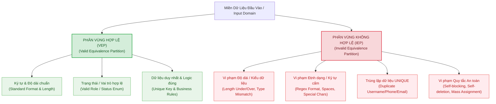

# MA TRẬN KIỂM THỬ PHÂN VÙNG TƯƠNG ĐƯƠNG (EQUIVALENCE PARTITIONING - EP TEST MATRIX)
## MODULE: XÁC THỰC & QUẢN LÝ NGƯỜI DÙNG (AUTHENTICATION & USER MANAGEMENT API)
### HỆ THỐNG: FUTURESUSHI BACKEND (`/api/auth` & `/api/users`)
**Dựa trên tài liệu đặc tả yêu cầu phần mềm (SRS - Software Requirements Specification)**

---

## 1. TỔNG QUAN & PHƯƠNG PHÁP LUẬN PHÂN VÙNG TƯƠNG ĐƯƠNG (EQUIVALENCE PARTITIONING METHODOLOGY)

### 1.1 Khái niệm & Nguyên lý kỹ thuật
**Phân vùng tương đương (Equivalence Partitioning - EP / Equivalence Class Testing - ECT)** là một kỹ thuật thiết kế kiểm thử hộp đen (Black-box Testing) nền tảng trong công nghệ phần mềm. Mục tiêu của EP là chia miền dữ liệu đầu vào và các điều kiện xử lý của phần mềm thành các phân vùng dữ liệu tương đương (**Equivalence Classes / Partitions**), trong đó mọi giá trị thuộc cùng một phân vùng được giả định là được hệ thống xử lý theo cách giống hệt nhau.

Một bộ kiểm thử theo kỹ thuật EP được phân chia làm hai nhóm phân vùng chính:
1. **Phân vùng tương đương hợp lệ (Valid Equivalence Partition - VEP)**: Tập hợp các giá trị đầu vào hợp lệ, đúng quy cách nghiệp vụ và schema mà hệ thống **phải chấp nhận** và xử lý thành công (thường trả về HTTP 200 OK, 201 Created).
2. **Phân vùng tương đương không hợp lệ (Invalid Equivalence Partition - IEP)**: Tập hợp các giá trị vi phạm quy chuẩn (độ dài, kiểu dữ liệu, cú pháp regex, trạng thái trùng lặp, logic quyền hạn) mà hệ thống **bắt buộc phải từ chối**, kích hoạt cơ chế validation và trả về mã lỗi phản hồi phù hợp (HTTP 400 Bad Request, 401 Unauthorized, 403 Forbidden, 404 Not Found, 422 Unprocessable Entity).

### 1.2 Nguyên tắc thiết kế ca kiểm thử (Test Case Derivation Rules)
- **Bao phủ phân vùng hợp lệ (Positive Test Cases)**: Mỗi ca kiểm thử có thể gộp nhiều phân vùng hợp lệ của các trường khác nhau nhằm tối ưu số lượng test case mà vẫn đảm bảo độ bao phủ 100% các VEP.
- **Cô lập phân vùng không hợp lệ (Negative Test Cases - Error Isolation)**: Đối với mỗi phân vùng không hợp lệ (IEP), **bắt buộc phải thiết kế một ca kiểm thử riêng biệt**, trong đó chỉ có duy nhất trường đang kiểm tra thuộc phân vùng không hợp lệ, tất cả các trường còn lại phải nằm trong phân vùng hợp lệ (tránh hiện tượng *Error Masking* - lỗi này che khuất lỗi kia).

---

## 2. BẢNG PHÂN TÍCH PHÂN VÙNG TƯƠNG ĐƯƠNG THEO THUỘC TÍNH (INPUT DOMAIN EP SPECIFICATIONS)

Dựa trên tài liệu đặc tả SRS của hệ thống FutureSushi, toàn bộ 11 thuộc tính dữ liệu và tham số được phân tích thành các phân vùng tương đương như sau:

| Thuộc tính (Attribute) | Kiểu DL & Ràng buộc SRS | Mã phân vùng | Loại phân vùng | Định nghĩa phân vùng tương đương | Giá trị đại diện kiểm thử (Test Sample) |
| :--- | :--- | :---: | :---: | :--- | :--- |
| **`id`** *(Mã người dùng)* | `BIGINT`, PK, Auto-increment, $\ge 1$, miền $[1, +\infty)$ | **VEP-ID-01** | Hợp lệ | Số nguyên dương $\ge 1$ tồn tại trong CSDL | `id = 1`, `id = 15` |
| | | **IEP-ID-01** | Không hợp lệ | Số nguyên không dương ($\le 0$) | `id = 0`, `id = -5` |
| | | **IEP-ID-02** | Không hợp lệ | Kiểu dữ liệu không phải số nguyên (Chuỗi, float, symbol) | `id = "abc"`, `id = 12.5`, `id = "!@#"` |
| | | **IEP-ID-03** | Không hợp lệ | Số nguyên dương hợp lệ nhưng không tồn tại trong DB | `id = 9999999` (Non-existent ID) |
| **`fullName`** *(Họ và tên)* | `VARCHAR(100)`, Bắt buộc, độ dài $[1, 100]$, không rỗng, tự động trim | **VEP-FN-01** | Hợp lệ | Chuỗi ký tự độ dài $1 \le L \le 100$ (Chữ tiếng Việt/Anh có dấu) | `"Nguyễn Văn An"`, `"A"` |
| | | **VEP-FN-02** | Hợp lệ | Chuỗi có khoảng trắng thừa ở hai đầu (Hệ thống tự trim) | `"   Trần Thị Bình   "` |
| | | **IEP-FN-01** | Không hợp lệ | Chuỗi rỗng (`""`) hoặc `null` / `undefined` | `""`, `null` |
| | | **IEP-FN-02** | Không hợp lệ | Chuỗi chỉ chứa toàn bộ ký tự khoảng trắng | `"      "` |
| | | **IEP-FN-03** | Không hợp lệ | Chuỗi vượt quá độ dài tối đa ($L > 100$ ký tự) | Chuỗi 101 ký tự (`"A..."`) |
| | | **IEP-FN-04** | Không hợp lệ | Sai kiểu dữ liệu (Số, Mảng, Object, Boolean) | `12345`, `["Nguyễn An"]`, `{}` |
| **`username`** *(Tên đăng nhập)* | `VARCHAR(40)`, Bắt buộc, UNIQUE, $[3, 40]$, không chứa dấu cách / ký tự đặc biệt không hợp lệ | **VEP-UN-01** | Hợp lệ | Chuỗi chữ cái/số không dấu, không khoảng trắng, $3 \le L \le 40$, chưa tồn tại | `"nguyenan2026"`, `"usr01"` |
| | | **IEP-UN-01** | Không hợp lệ | Độ dài ngắn hơn quy định ($L < 3$ ký tự) | `"us"`, `"a"` |
| | | **IEP-UN-02** | Không hợp lệ | Độ dài vượt quá quy định ($L > 40$ ký tự) | Chuỗi 41 ký tự |
| | | **IEP-UN-03** | Không hợp lệ | Chứa ký tự khoảng trắng (ở giữa hoặc hai đầu) | `"user name"`, `" user"`, `"user "` |
| | | **IEP-UN-04** | Không hợp lệ | Chứa ký tự đặc biệt không hợp lệ hoặc dấu tiếng Việt | `"user@#$%"`, `"nguyễnvăn"` |
| | | **IEP-UN-05** | Không hợp lệ | Tên đăng nhập đã tồn tại trong CSDL (Duplicate UNIQUE) | `"admin"` (Tài khoản đã có sẵn) |
| | | **IEP-UN-06** | Không hợp lệ | Để trống (`""`), `null` hoặc `undefined` | `""`, `null` |
| **`password`** *(Mật khẩu)* | `VARCHAR(255)`, Bắt buộc khi tạo, $[6, 255]$, băm bcrypt, không trả về API | **VEP-PW-01** | Hợp lệ | Chuỗi mật khẩu có độ dài $6 \le L \le 255$ ký tự | `"Password123@"`, `"secret2026"` |
| | | **IEP-PW-01** | Không hợp lệ | Độ dài ngắn hơn quy định ($L < 6$ ký tự) | `"12345"`, `"abc"` |
| | | **IEP-PW-02** | Không hợp lệ | Độ dài vượt quá quy định ($L > 255$ ký tự) | Chuỗi 256 ký tự |
| | | **IEP-PW-03** | Không hợp lệ | Mật khẩu để trống (`""`), `null`, `undefined` khi tạo | `""`, `null` |
| **`phone`** *(Số điện thoại)* | `VARCHAR(20)`, Bắt buộc, UNIQUE, đúng 10 số VN (đầu 03, 05, 07, 08, 09), miền $[10, 20]$ | **VEP-PH-01** | Hợp lệ | Chuỗi đúng 10 chữ số bắt đầu bằng `03` | `"0398765432"` |
| | | **VEP-PH-02** | Hợp lệ | Chuỗi đúng 10 chữ số bắt đầu bằng `05` | `"0567890123"` |
| | | **VEP-PH-03** | Hợp lệ | Chuỗi đúng 10 chữ số bắt đầu bằng `07` | `"0701234567"` |
| | | **VEP-PH-04** | Hợp lệ | Chuỗi đúng 10 chữ số bắt đầu bằng `08` | `"0888999000"` |
| | | **VEP-PH-05** | Hợp lệ | Chuỗi đúng 10 chữ số bắt đầu bằng `09` | `"0912345678"` |
| | | **IEP-PH-01** | Không hợp lệ | Độ dài ít hơn 10 chữ số ($L < 10$) | `"091234567"` (9 số) |
| | | **IEP-PH-02** | Không hợp lệ | Độ dài lớn hơn quy định ($L > 20$) | `"091234567890123456789"` (21 ký tự) |
| | | **IEP-PH-03** | Không hợp lệ | Sai đầu số chuẩn VN (Đầu số cố định 02, 01, 04 hoặc đầu khác 1-9) | `"0241234567"`, `"0123456789"`, `"19001560"` |
| | | **IEP-PH-04** | Không hợp lệ | Chứa ký tự chữ cái hoặc ký tự đặc biệt | `"091234abcd"`, `"0912-345-678"` |
| | | **IEP-PH-05** | Không hợp lệ | Số điện thoại đã được đăng ký (Duplicate UNIQUE) | `"0900000001"` (Đã có trong DB) |
| | | **IEP-PH-06** | Không hợp lệ | Bỏ trống (`""`), `null`, `undefined` | `""`, `null` |
| **`email`** *(Địa chỉ email)* | `VARCHAR(100)`, Nullable / Tùy chọn, UNIQUE nếu có, RFC 5322, $[5, 100]$ | **VEP-EM-01** | Hợp lệ | Định dạng RFC 5322 chuẩn, độ dài $5 \le L \le 100$, chưa tồn tại | `"customer01@gmail.com"`, `"a@b.c"` |
| | | **VEP-EM-02** | Hợp lệ | Trường không được cung cấp (`null` hoặc omitted) | `null`, `undefined` |
| | | **IEP-EM-01** | Không hợp lệ | Sai định dạng RFC 5322 (Thiếu `@`, thiếu domain, chứa dấu cách) | `"customer.gmail.com"`, `"cust@.com"`, `"a @b.com"` |
| | | **IEP-EM-02** | Không hợp lệ | Độ dài ngắn hơn quy định ($L < 5$ ký tự) | `"a@b."` (4 ký tự) |
| | | **IEP-EM-03** | Không hợp lệ | Độ dài vượt quá quy định ($L > 100$ ký tự) | Email 101 ký tự (`"a...a@domain.com"`) |
| | | **IEP-EM-04** | Không hợp lệ | Email đã tồn tại trong CSDL (Duplicate UNIQUE) | `"admin@futuresushi.com"` (Đã tồn tại) |
| **`role`** *(Vai trò / Phân quyền)* | `ENUM`, Thuộc 4 giá trị cố định, Mặc định `CUSTOMER` khi tự đăng ký | **VEP-RL-01** | Hợp lệ | Vai trò Khách hàng: `"CUSTOMER"` | `"CUSTOMER"` |
| | | **VEP-RL-02** | Hợp lệ | Vai trò Nhân viên phục vụ/Thu ngân: `"STAFF"` | `"STAFF"` |
| | | **VEP-RL-03** | Hợp lệ | Vai trò Nhân viên bếp: `"KITCHEN"` | `"KITCHEN"` |
| | | **VEP-RL-04** | Hợp lệ | Vai trò Quản trị viên: `"ADMIN"` | `"ADMIN"` |
| | | **IEP-RL-01** | Không hợp lệ | Giá trị không nằm trong danh mục ENUM quy định | `"SUPERADMIN"`, `"MANAGER"`, `"GUEST"`, `"USER"` |
| | | **IEP-RL-02** | Không hợp lệ | Sai kiểu dữ liệu (Số nguyên, Boolean, Mảng) | `1`, `true`, `["ADMIN"]` |
| **`status`** *(Trạng thái tài khoản)* | `ENUM`, Thuộc 2 giá trị cố định: `ACTIVE` hoặc `BLOCKED` | **VEP-ST-01** | Hợp lệ | Trạng thái Đang hoạt động: `"ACTIVE"` | `"ACTIVE"` |
| | | **VEP-ST-02** | Hợp lệ | Trạng thái Bị khóa: `"BLOCKED"` | `"BLOCKED"` |
| | | **IEP-ST-01** | Không hợp lệ | Giá trị không nằm trong danh mục ENUM quy định | `"INACTIVE"`, `"PENDING"`, `"SUSPENDED"`, `"DELETED"` |
| | | **IEP-ST-02** | Không hợp lệ | Sai kiểu dữ liệu (Số nguyên, Object, Null khi cập nhật bắt buộc) | `0`, `{}`, `null` |
| **`points`** *(Điểm tích lũy)* | `INTEGER`, Số nguyên không âm, miền $[0, 10.000.000]$, Mặc định 0 | **VEP-PT-01** | Hợp lệ | Số nguyên nằm trong khoảng $[0, 10.000.000]$ | `0`, `500`, `10000000` |
| | | **VEP-PT-02** | Hợp lệ | Bỏ trống / Không truyền khi tạo tài khoản (Mặc định gán = 0) | `undefined` |
| | | **IEP-PT-01** | Không hợp lệ | Số nguyên âm ($< 0$) | `-1`, `-500` |
| | | **IEP-PT-02** | Không hợp lệ | Vượt quá số điểm tối đa quy định ($> 10.000.000$) | `10000001`, `99999999` |
| | | **IEP-PT-03** | Không hợp lệ | Số thực / Thập phân không phải số nguyên | `100.5`, `25.75` |
| | | **IEP-PT-04** | Không hợp lệ | Kiểu dữ liệu không phải số (Chuỗi không parse được, Object, Array) | `"abc"`, `[100]`, `{}` |
| **`avatar`** *(Ảnh đại diện)* | `TEXT`, Chuỗi URL hoặc Base64, $[0, 10.000]$ ký tự | **VEP-AV-01** | Hợp lệ | Chuỗi URL hợp lệ có độ dài $\le 10.000$ ký tự | `"https://cdn.futuresushi.com/avatar/user01.png"` |
| | | **VEP-AV-02** | Hợp lệ | Chuỗi Base64 Data URI có độ dài $\le 10.000$ ký tự | `"data:image/png;base64,iVBORw0KGgo..."` |
| | | **VEP-AV-03** | Hợp lệ | Không truyền hoặc chuỗi rỗng (`""` / `null`) | `null`, `""`, `undefined` |
| | | **IEP-AV-01** | Không hợp lệ | Chuỗi vượt quá $10.000$ ký tự | Chuỗi Base64 dài $10.001$ ký tự |
| **`search`** *(Từ khóa tra cứu)* | Chuỗi tùy chọn tra cứu đồng thời fullName, username, email, phone, $[0, 100]$ | **VEP-SC-01** | Hợp lệ | Chuỗi tìm kiếm có độ dài $0 \le L \le 100$ | `"Nguyễn"`, `"0912"`, `"user01"`, `""` |
| | | **IEP-SC-01** | Không hợp lệ | Chuỗi tìm kiếm vượt quá 100 ký tự | Chuỗi tìm kiếm 101 ký tự |

---

## 3. PHÂN VÙNG TƯƠNG ĐƯƠNG CHO QUY TẮC AN TOÀN & LOGIC NGHIỆP VỤ (SAFETY & INTEGRITY PARTITIONS)

| Quy tắc / Cơ chế nghiệp vụ | Mã phân vùng | Loại | Đặc tả điều kiện kiểm thử | Kết quả mong đợi (Expected Outcome) |
| :--- | :---: | :---: | :--- | :--- |
| **Chống tự khóa tài khoản Admin** *(Self-blocking Defense)* | **VEP-SEC-01** | Hợp lệ | Admin cập nhật trạng thái `BLOCKED` cho tài khoản người dùng khác (`targetUserId != currentUserId`) | HTTP 200 OK: Trạng thái tài khoản mục tiêu chuyển thành `BLOCKED`. |
| | **IEP-SEC-01** | Không hợp lệ | Admin đang đăng nhập cố gắng tự chuyển trạng thái của chính mình (`targetUserId == currentUserId`) sang `BLOCKED` | HTTP 400 Bad Request: Từ chối thao tác, thông báo "Bạn không thể tự khóa tài khoản của chính mình". |
| **Chống tự xóa tài khoản Admin** *(Self-deletion Defense)* | **VEP-SEC-02** | Hợp lệ | Admin thực hiện xóa tài khoản người dùng khác (`targetUserId != currentUserId`) | HTTP 200 OK: Tài khoản mục tiêu bị xóa thành công khỏi hệ thống. |
| | **IEP-SEC-02** | Không hợp lệ | Admin đang đăng nhập cố gắng tự gửi yêu cầu xóa chính tài khoản của mình (`targetUserId == currentUserId`) | HTTP 400 Bad Request: Từ chối thao tác, thông báo "Bạn không thể tự xóa tài khoản của chính mình". |
| **Chống ghi đè hàng loạt** *(Mass Assignment Protection)* | **VEP-SEC-03** | Hợp lệ | Admin có toàn quyền cập nhật các trường nhạy cảm: `role`, `status`, `username`, `email`, `points` | HTTP 200 OK: Các trường được cập nhật đầy đủ và chính xác. |
| | **VEP-SEC-04** | Hợp lệ | Tài khoản vai trò phi Admin (như STAFF) gửi payload cập nhật thông tin thành viên chỉ được cập nhật `points`, `fullName`, `phone`, `avatar` | HTTP 200 OK: Chỉ cập nhật các trường được phép; các trường `role`, `status`, `username` bị bỏ qua/sanitized. |
| **Đăng nhập đa định danh** *(Multi-Identifier Login)* | **VEP-AUTH-01** | Hợp lệ | Đăng nhập bằng `username` chính xác + `password` đúng của tài khoản `ACTIVE` | HTTP 200 OK: Trả về JWT Token và thông tin User (`role`, `fullName`, v.v.). |
| | **VEP-AUTH-02** | Hợp lệ | Đăng nhập bằng `phone` chính xác + `password` đúng của tài khoản `ACTIVE` | HTTP 200 OK: Trả về JWT Token và thông tin User. |
| | **VEP-AUTH-03** | Hợp lệ | Đăng nhập bằng `email` chính xác + `password` đúng của tài khoản `ACTIVE` | HTTP 200 OK: Trả về JWT Token và thông tin User. |
| | **IEP-AUTH-01** | Không hợp lệ | Đăng nhập với tài khoản không tồn tại trên hệ thống (sai cả 3 định danh) | HTTP 404 Not Found: Thông báo "Tài khoản không tồn tại!". |
| | **IEP-AUTH-02** | Không hợp lệ | Đăng nhập với định danh tồn tại nhưng nhập sai `password` | HTTP 400 Bad Request: Thông báo "Mật khẩu không chính xác!". |
| | **IEP-AUTH-03** | Không hợp lệ | Đăng nhập với tài khoản có trạng thái `BLOCKED` (kể cả khi nhập đúng mật khẩu) | HTTP 403 Forbidden: Từ chối đăng nhập, thông báo tài khoản đã bị khóa. |
| | **IEP-AUTH-04** | Không hợp lệ | Gửi request đăng nhập thiếu trường `account` hoặc `password` | HTTP 400 Bad Request: Thông báo "Vui lòng nhập đầy đủ thông tin!". |
| **Xác thực JWT & Phân quyền truy cập** *(JWT Authentication & RBAC)* | **VEP-JWT-01** | Hợp lệ | Gửi Header `Authorization: Bearer <valid_token>` với vai trò ADMIN truy cập API quản trị | HTTP 200 / 201: Cho phép truy cập tài nguyên. |
| | **IEP-JWT-01** | Không hợp lệ | Không gửi Header `Authorization` hoặc Header rỗng | HTTP 401 Unauthorized: Bị từ chối truy cập. |
| | **IEP-JWT-02** | Không hợp lệ | Token sai cấu trúc (Malformed Token), chữ ký không hợp lệ (Invalid Signature) | HTTP 401 / 403: Bị từ chối truy cập. |
| | **IEP-JWT-03** | Không hợp lệ | Token đã hết hạn (Expired Token vượt quá 7 ngày) | HTTP 401 Unauthorized: Bị từ chối truy cập. |
| | **IEP-JWT-04** | Không hợp lệ | Token hợp lệ nhưng quyền không đủ (Ví dụ CUSTOMER truy cập API Admin `/api/users`) | HTTP 403 Forbidden: Không có quyền truy cập. |

---

## 4. MA TRẬN TEST CASES CHI TIẾT THEO PHƯƠNG PHÁP EP (EP TEST CASES MATRIX)

---

### 📌 KHỐI 1: POST `/api/auth/register` (ĐĂNG KÝ TÀI KHOẢN KHÁCH HÀNG)

| Test Case ID | Phân vùng kiểm thử (Equivalence Class) | Mục tiêu kiểm thử | Dữ liệu đầu vào (Request Body Payload) | HTTP Mong đợi | Nội dung phản hồi mong đợi | Ưu tiên |
| :--- | :---: | :--- | :--- | :---: | :--- | :---: |
| **TC_EP_REG_001** | **VEP-FN-01**, **VEP-UN-01**, **VEP-PW-01**, **VEP-PH-05**, **VEP-EM-01** | Đăng ký thành công với tất cả các trường hợp lệ đầy đủ | `{"fullName": "Trần Văn Hợp Lệ", "email": "valid_cust1@gmail.com", "phone": "0912345678", "username": "cust_valid01", "password": "Password123@"}` | `201 Created` | `message: "Đăng ký thành công!"`, `user.role: "CUSTOMER"`, `user.points: 0` | P1 |
| **TC_EP_REG_002** | **VEP-EM-02** | Đăng ký thành công khi không cung cấp trường email (Nullable) | `{"fullName": "Lê Văn Bình", "phone": "0987654321", "username": "cust_noemail", "password": "Password123@"}` | `201 Created` | `message: "Đăng ký thành công!"`, `email: null` | P1 |
| **TC_EP_REG_003** | **VEP-FN-02** | Đăng ký thành công với họ tên chứa khoảng trắng thừa hai đầu (Hệ thống tự trim) | `{"fullName": "   Nguyễn Hoàng An   ", "phone": "0345678901", "username": "cust_trim", "password": "Password123@"}` | `201 Created` | `user.fullName: "Nguyễn Hoàng An"` | P2 |
| **TC_EP_REG_004** | **VEP-PH-01** to **VEP-PH-04** | Đăng ký thành công với các đầu số di động VN khác (03, 05, 07, 08) | `{"fullName": "Phạm Văn C", "phone": "0388999000", "username": "cust_prefix03", "password": "Password123@"}` | `201 Created` | `message: "Đăng ký thành công!"`, `user.phone: "0388999000"` | P2 |
| **TC_EP_REG_005** | **IEP-FN-01** | Từ chối khi `fullName` bị rỗng (`""`) | `{"fullName": "", "phone": "0912345678", "username": "cust_err1", "password": "Password123@"}` | `400 Bad Request` | `message: /họ và tên|không được để trống/i` | P1 |
| **TC_EP_REG_006** | **IEP-FN-02** | Từ chối khi `fullName` chỉ chứa toàn khoảng trắng | `{"fullName": "     ", "phone": "0912345678", "username": "cust_err2", "password": "Password123@"}` | `400 Bad Request` | `message: /họ và tên/i` | P1 |
| **TC_EP_REG_007** | **IEP-FN-03** | Từ chối khi `fullName` vượt quá 100 ký tự | `{"fullName": "Chuỗi họ tên 101 ký tự...", "phone": "0912345678", "username": "cust_err3", "password": "Password123@"}` | `400 Bad Request` | `message: /quá dài|tối đa 100 ký tự/i` | P2 |
| **TC_EP_REG_008** | **IEP-UN-01** | Từ chối khi `username` ngắn hơn 3 ký tự | `{"fullName": "Trần A", "phone": "0912345678", "username": "ab", "password": "Password123@"}` | `400 Bad Request` | `message: /tối thiểu 3 ký tự|tên đăng nhập/i` | P1 |
| **TC_EP_REG_009** | **IEP-UN-02** | Từ chối khi `username` vượt quá 40 ký tự | `{"fullName": "Trần A", "phone": "0912345678", "username": "chuoi_username_dai_hon_40_ky_tu_1234567890123", "password": "Password123@"}` | `400 Bad Request` | `message: /tối đa 40 ký tự/i` | P2 |
| **TC_EP_REG_010** | **IEP-UN-03** | Từ chối khi `username` chứa dấu cách | `{"fullName": "Trần A", "phone": "0912345678", "username": "user test", "password": "Password123@"}` | `400 Bad Request` | `message: /không chứa khoảng trắng|không hợp lệ/i` | P1 |
| **TC_EP_REG_011** | **IEP-UN-04** | Từ chối khi `username` chứa ký tự đặc biệt không hợp lệ | `{"fullName": "Trần A", "phone": "0912345678", "username": "user#$@!", "password": "Password123@"}` | `400 Bad Request` | `message: /ký tự đặc biệt|không hợp lệ/i` | P1 |
| **TC_EP_REG_012** | **IEP-UN-05** | Từ chối khi `username` đã tồn tại trong CSDL | `{"fullName": "Trần A", "phone": "0919999999", "username": "admin", "password": "Password123@"}` | `400 Bad Request` | `message: "Tên đăng nhập này đã tồn tại!"` | P1 |
| **TC_EP_REG_013** | **IEP-PW-01** | Từ chối khi `password` ngắn hơn 6 ký tự | `{"fullName": "Trần A", "phone": "0912345678", "username": "cust_pw5", "password": "12345"}` | `400 Bad Request` | `message: /mật khẩu tối thiểu 6 ký tự/i` | P1 |
| **TC_EP_REG_014** | **IEP-PW-02** | Từ chối khi `password` vượt quá 255 ký tự | `{"fullName": "Trần A", "phone": "0912345678", "username": "cust_pw256", "password": "Chuỗi mật khẩu dài 256 ký tự..."}` | `400 Bad Request` | `message: /mật khẩu tối đa 255 ký tự/i` | P2 |
| **TC_EP_REG_015** | **IEP-PW-03** | Từ chối khi `password` bị bỏ trống (`""`) | `{"fullName": "Trần A", "phone": "0912345678", "username": "cust_pw_empty", "password": ""}` | `400 Bad Request` | `message: "Vui lòng nhập Mật khẩu!"` | P1 |
| **TC_EP_REG_016** | **IEP-PH-01** | Từ chối khi `phone` không đủ 10 số (Ví dụ 9 chữ số) | `{"fullName": "Trần A", "phone": "091234567", "username": "cust_ph9", "password": "Password123@"}` | `400 Bad Request` | `message: /số điện thoại không hợp lệ/i` | P1 |
| **TC_EP_REG_017** | **IEP-PH-03** | Từ chối khi `phone` sai đầu số VN (Ví dụ đầu 02, 01, 19) | `{"fullName": "Trần A", "phone": "0241234567", "username": "cust_ph_badprefix", "password": "Password123@"}` | `400 Bad Request` | `message: /số điện thoại không hợp lệ/i` | P1 |
| **TC_EP_REG_018** | **IEP-PH-04** | Từ chối khi `phone` chứa ký tự chữ cái | `{"fullName": "Trần A", "phone": "0912345abc", "username": "cust_ph_char", "password": "Password123@"}` | `400 Bad Request` | `message: /số điện thoại/i` | P1 |
| **TC_EP_REG_019** | **IEP-PH-05** | Từ chối khi `phone` đã được đăng ký trong hệ thống | `{"fullName": "Trần A", "phone": "0900000001", "username": "cust_ph_dup", "password": "Password123@"}` | `400 Bad Request` | `message: "Số điện thoại này đã được đăng ký!"` | P1 |
| **TC_EP_REG_020** | **IEP-EM-01** | Từ chối khi `email` sai định dạng chuẩn RFC 5322 (Thiếu domain / `@`) | `{"fullName": "Trần A", "email": "invalid_email_format", "phone": "0912345678", "username": "cust_em_bad", "password": "Password123@"}` | `400 Bad Request` | `message: /email không hợp lệ/i` | P1 |
| **TC_EP_REG_021** | **IEP-EM-04** | Từ chối khi `email` đã tồn tại trong hệ thống | `{"fullName": "Trần A", "email": "admin@futuresushi.com", "phone": "0912345678", "username": "cust_em_dup", "password": "Password123@"}` | `400 Bad Request` | `message: "Email này đã tồn tại trong hệ thống!"` | P1 |

---

### 📌 KHỐI 2: POST `/api/auth/login` (XÁC THỰC ĐĂNG NHẬP & KIỂM TRA TRẠNG THÁI)

| Test Case ID | Phân vùng kiểm thử | Mục tiêu kiểm thử | Payload Đăng nhập (`account` & `password`) | Trạng thái tài khoản trong DB | HTTP Mong đợi | Nội dung phản hồi mong đợi | Ưu tiên |
| :--- | :---: | :--- | :--- | :---: | :---: | :--- | :---: |
| **TC_EP_LOG_001** | **VEP-AUTH-01** | Đăng nhập thành công bằng **Username** + Mật khẩu đúng | `{"account": "admin", "password": "Password123@"}` | `ACTIVE` | `200 OK` | `message: "Đăng nhập thành công!"`, `token: "<JWT>"`, `user.role: "ADMIN"` | P1 |
| **TC_EP_LOG_002** | **VEP-AUTH-02** | Đăng nhập thành công bằng **Số điện thoại** + Mật khẩu đúng | `{"account": "0900000001", "password": "Password123@"}` | `ACTIVE` | `200 OK` | `message: "Đăng nhập thành công!"`, `token: "<JWT>"` | P1 |
| **TC_EP_LOG_003** | **VEP-AUTH-03** | Đăng nhập thành công bằng **Email** + Mật khẩu đúng | `{"account": "admin@futuresushi.com", "password": "Password123@"}` | `ACTIVE` | `200 OK` | `message: "Đăng nhập thành công!"`, `token: "<JWT>"` | P1 |
| **TC_EP_LOG_004** | **IEP-AUTH-01** | Đăng nhập thất bại khi tài khoản không tồn tại | `{"account": "nonexistent_account_999", "password": "Password123@"}` | Không có trong DB | `404 Not Found` | `message: "Tài khoản không tồn tại!"` | P1 |
| **TC_EP_LOG_005** | **IEP-AUTH-02** | Đăng nhập thất bại khi nhập sai mật khẩu | `{"account": "admin", "password": "WrongPassword123"}` | `ACTIVE` | `400 Bad Request` | `message: "Mật khẩu không chính xác!"` | P1 |
| **TC_EP_LOG_006** | **IEP-AUTH-03** | **Từ chối đăng nhập khi tài khoản có trạng thái BLOCKED** | `{"account": "blocked_user01", "password": "Password123@"}` | `BLOCKED` | `403 Forbidden` | `message: "Tài khoản của bạn đã bị khóa. Vui lòng liên hệ quản trị viên!"` | P1 |
| **TC_EP_LOG_007** | **IEP-AUTH-04** | Đăng nhập thiếu trường `account` | `{"password": "Password123@"}` | N/A | `400 Bad Request` | `message: "Vui lòng nhập đầy đủ thông tin!"` | P1 |
| **TC_EP_LOG_008** | **IEP-AUTH-04** | Đăng nhập thiếu trường `password` | `{"account": "admin"}` | N/A | `400 Bad Request` | `message: "Vui lòng nhập đầy đủ thông tin!"` | P1 |

---

### 📌 KHỐI 3: QUYỀN TRUY CẬP VÀ XÁC THỰC JWT (JWT AUTHENTICATION & RBAC)

| Test Case ID | Phân vùng kiểm thử | Endpoint & Phương thức | Header Authorization | Vai trò Token | HTTP Mong đợi | Kết quả kiểm thử mong đợi | Ưu tiên |
| :--- | :---: | :--- | :--- | :---: | :---: | :--- | :---: |
| **TC_EP_SEC_001** | **VEP-JWT-01** | `GET /api/users` | `Bearer <valid_admin_jwt>` | `ADMIN` | `200 OK` | Truy cập thành công danh sách người dùng | P1 |
| **TC_EP_SEC_002** | **VEP-JWT-01** | `GET /api/users` | `Bearer <valid_staff_jwt>` | `STAFF` | `200 OK` | Truy cập thành công (Cho phép Staff & Admin) | P1 |
| **TC_EP_SEC_003** | **IEP-JWT-01** | `GET /api/users` | *(Không gửi Header)* | Không có | `401 Unauthorized` | Bị từ chối: Thiếu Token xác thực | P1 |
| **TC_EP_SEC_004** | **IEP-JWT-02** | `GET /api/users` | `Bearer invalid_garbage_token` | N/A | `401 / 403` | Bị từ chối: Token sai định dạng / Sai chữ ký | P1 |
| **TC_EP_SEC_005** | **IEP-JWT-03** | `GET /api/users` | `Bearer <expired_jwt_7days>` | `ADMIN` | `401 Unauthorized` | Bị từ chối: Token đã hết hạn | P1 |
| **TC_EP_SEC_006** | **IEP-JWT-04** | `POST /api/users` | `Bearer <customer_jwt>` | `CUSTOMER` | `403 Forbidden` | Bị từ chối: Không có quyền Admin | P1 |

---

### 📌 KHỐI 4: POST `/api/users` (ADMIN TẠO MỚI TÀI KHOẢN VÀ PHÂN QUYỀN)

| Test Case ID | Phân vùng kiểm thử | Mục tiêu kiểm thử | Dữ liệu đầu vào (Request Body) | HTTP Mong đợi | Nội dung phản hồi mong đợi | Ưu tiên |
| :--- | :---: | :--- | :--- | :---: | :--- | :---: |
| **TC_EP_ADM_CRT_001** | **VEP-RL-02**, **VEP-PT-02** | Admin tạo thành công tài khoản Nhân viên (`STAFF`) | `{"fullName": "Nguyễn Staff", "phone": "0911223344", "username": "staff_new01", "password": "Password123@", "role": "STAFF"}` | `201 Created` | `message: "Tạo người dùng thành công"`, `user.role: "STAFF"` | P1 |
| **TC_EP_ADM_CRT_002** | **VEP-RL-03** | Admin tạo thành công tài khoản Bếp (`KITCHEN`) | `{"fullName": "Lê Kitchen", "phone": "0922334455", "username": "kitchen_new01", "password": "Password123@", "role": "KITCHEN"}` | `201 Created` | `message: "Tạo người dùng thành công"`, `user.role: "KITCHEN"` | P1 |
| **TC_EP_ADM_CRT_003** | **VEP-RL-04** | Admin tạo thành công tài khoản Quản trị viên phụ (`ADMIN`) | `{"fullName": "Phạm Admin 2", "phone": "0933445566", "username": "admin_sub01", "password": "Password123@", "role": "ADMIN"}` | `201 Created` | `message: "Tạo người dùng thành công"`, `user.role: "ADMIN"` | P1 |
| **TC_EP_ADM_CRT_004** | **IEP-RL-01** | Từ chối tạo tài khoản khi truyền vai trò không hợp lệ | `{"fullName": "Võ Error", "phone": "0944556677", "username": "user_badrole", "password": "Password123@", "role": "SUPERADMIN"}` | `400 Bad Request` | `message: /vai trò không hợp lệ/i` | P1 |
| **TC_EP_ADM_CRT_005** | **IEP-UN-05** | Từ chối khi tên đăng nhập đã tồn tại | `{"fullName": "Võ Error", "phone": "0955667788", "username": "admin", "password": "Password123@", "role": "STAFF"}` | `400 Bad Request` | `message: /tài khoản hoặc số điện thoại đã tồn tại/i` | P1 |
| **TC_EP_ADM_CRT_006** | **IEP-EM-04** | Từ chối khi email đã tồn tại | `{"fullName": "Võ Error", "email": "admin@futuresushi.com", "phone": "0966778899", "username": "user_new100", "password": "Password123@", "role": "STAFF"}` | `400 Bad Request` | `message: /tài khoản, email hoặc số điện thoại đã tồn tại/i` | P1 |

---

### 📌 KHỐI 5: GET `/api/users` (TRA CỨU, LỌC VÀ TÌM KIẾM NGƯỜI DÙNG)

| Test Case ID | Phân vùng kiểm thử | Mục tiêu kiểm thử | Query Parameters | HTTP Mong đợi | Nội dung phản hồi mong đợi | Ưu tiên |
| :--- | :---: | :--- | :--- | :---: | :--- | :---: |
| **TC_EP_GET_001** | **VEP-SC-01** (Empty) | Lấy toàn bộ danh sách người dùng khi không lọc | *(Không có Query Params)* | `200 OK` | Danh sách mảng User, không chứa trường `password` | P1 |
| **TC_EP_GET_002** | **VEP-RL-01** | Lọc danh sách theo vai trò `CUSTOMER` | `?role=CUSTOMER` | `200 OK` | Mọi user trả về đều có `role === "CUSTOMER"` | P1 |
| **TC_EP_GET_003** | **VEP-RL-02** | Lọc danh sách theo vai trò `STAFF` | `?role=STAFF` | `200 OK` | Mọi user trả về đều có `role === "STAFF"` | P2 |
| **TC_EP_GET_004** | **VEP-ST-01** | Lọc danh sách theo trạng thái `ACTIVE` | `?status=ACTIVE` | `200 OK` | Mọi user trả về đều có `status === "ACTIVE"` | P1 |
| **TC_EP_GET_005** | **VEP-ST-02** | Lọc danh sách theo trạng thái `BLOCKED` | `?status=BLOCKED` | `200 OK` | Mọi user trả về đều có `status === "BLOCKED"` | P1 |
| **TC_EP_GET_006** | **VEP-SC-01** | Tìm kiếm đồng thời theo họ tên hoặc số điện thoại | `?search=0912` | `200 OK` | Danh sách user chứa từ khóa `"0912"` trong phone/name/email/username | P1 |

---

### 📌 KHỐI 6: GET `/api/users/:id` (LẤY CHI TIẾT NGƯỜI DÙNG THEO ID)

| Test Case ID | Phân vùng kiểm thử | Mục tiêu kiểm thử | Tham số URL `id` | HTTP Mong đợi | Nội dung phản hồi mong đợi | Ưu tiên |
| :--- | :---: | :--- | :--- | :---: | :--- | :---: |
| **TC_EP_GETID_001** | **VEP-ID-01** | Lấy chi tiết thành công người dùng tồn tại | `/api/users/1` | `200 OK` | Object thông tin User, `id === 1`, không lộ `password` | P1 |
| **TC_EP_GETID_002** | **IEP-ID-03** | Báo lỗi khi `id` không tồn tại trong CSDL | `/api/users/999999` | `404 Not Found` | `message: "Không tìm thấy người dùng"` | P1 |
| **TC_EP_GETID_003** | **IEP-ID-02** | Xử lý khi `id` không phải định dạng số nguyên | `/api/users/abc` | `400 / 404 / 500` | Thông báo lỗi không tìm thấy / tham số không hợp lệ | P2 |

---

### 📌 KHỐI 7: PUT `/api/users/:id` (CẬP NHẬT NGƯỜI DÙNG, PHÂN QUYỀN & BẢO VỆ AN TOÀN)

| Test Case ID | Phân vùng kiểm thử | Mục tiêu kiểm thử & Kịch bản bảo vệ | Caller Role | Target ID | Request Body Payload | HTTP Mong đợi | Kết quả xác nhận CSDL & Response | Ưu tiên |
| :--- | :---: | :--- | :---: | :---: | :--- | :---: | :--- | :---: |
| **TC_EP_UPD_001** | **VEP-SEC-03**, **VEP-PT-01** | Admin cập nhật hợp lệ thông tin, vai trò, điểm thưởng cho User khác | `ADMIN` | `2` *(Staff)* | `{"fullName": "Nhân Viên Sửa", "points": 5000, "role": "STAFF"}` | `200 OK` | `user.fullName: "Nhân Viên Sửa"`, `user.points: 5000` | P1 |
| **TC_EP_UPD_002** | **VEP-SEC-01**, **VEP-ST-02** | **Admin khóa tài khoản người dùng khác (`status = BLOCKED`)** | `ADMIN` | `2` *(Other)* | `{"status": "BLOCKED"}` | `200 OK` | `user.status === "BLOCKED"`. Tài khoản này sau đó không thể đăng nhập. | P1 |
| **TC_EP_UPD_003** | **IEP-SEC-01** | **PHÒNG VỆ: Admin cố gắng tự khóa tài khoản của chính mình (`BLOCKED`)** | `ADMIN` (`id=1`) | `1` *(Self)* | `{"status": "BLOCKED"}` | `400 Bad Request` | `message: "Bạn không thể tự khóa tài khoản của chính mình"`. Trạng thái Admin giữ nguyên `ACTIVE`. | P1 |
| **TC_EP_UPD_004** | **VEP-SEC-04** | **MASS ASSIGNMENT: Staff cố tình gửi payload sửa `role=ADMIN` và `status=BLOCKED`** | `STAFF` | `3` *(Cust)* | `{"role": "ADMIN", "status": "BLOCKED", "points": 100}` | `200 OK` | `points` cập nhật thành 100; `role` và `status` **KHÔNG** bị thay đổi (bảo vệ an toàn thành công). | P1 |
| **TC_EP_UPD_005** | **IEP-PT-01** | Từ chối khi cập nhật điểm thưởng số âm | `ADMIN` | `2` | `{"points": -100}` | `400 Bad Request` | `message: /điểm thưởng không thể âm|không hợp lệ/i` | P1 |
| **TC_EP_UPD_006** | **IEP-PT-02** | Từ chối khi cập nhật điểm thưởng vượt quá 10.000.000 | `ADMIN` | `2` | `{"points": 10000001}` | `400 Bad Request` | `message: /điểm thưởng tối đa 10.000.000/i` | P2 |
| **TC_EP_UPD_007** | **IEP-ID-03** | Báo lỗi khi cập nhật `id` không tồn tại | `ADMIN` | `99999` | `{"fullName": "Test"}` | `404 Not Found` | `message: "Không tìm thấy người dùng"` | P1 |

---

### 📌 KHỐI 8: DELETE `/api/users/:id` (XÓA NGƯỜI DÙNG & PHÒNG VỆ TỰ XÓA)

| Test Case ID | Phân vùng kiểm thử | Mục tiêu kiểm thử & Kịch bản bảo vệ | Caller Role | Target ID | HTTP Mong đợi | Kết quả phản hồi mong đợi | Ưu tiên |
| :--- | :---: | :--- | :---: | :---: | :--- | :---: | :--- | :---: |
| **TC_EP_DEL_001** | **VEP-SEC-02** | Admin xóa thành công tài khoản người dùng khác | `ADMIN` (`id=1`) | `4` *(Other User)* | `200 OK` | `message: "Xóa người dùng thành công"`. User bị xóa khỏi DB. | P1 |
| **TC_EP_DEL_002** | **IEP-SEC-02** | **PHÒNG VỆ: Admin cố gắng tự xóa tài khoản của chính mình (`targetUserId == currentUserId`)** | `ADMIN` (`id=1`) | `1` *(Self Admin)* | `400 Bad Request` | `message: "Bạn không thể tự xóa tài khoản của chính mình"`. Tài khoản Admin không bị xóa. | P1 |
| **TC_EP_DEL_003** | **IEP-ID-03** | Báo lỗi khi xóa tài khoản không tồn tại | `ADMIN` | `999999` | `404 Not Found` | `message: "Không tìm thấy người dùng"` | P1 |
| **TC_EP_DEL_004** | **IEP-JWT-04** | Nhân viên hoặc Khách hàng cố gắng gọi API xóa người dùng | `STAFF` / `CUSTOMER` | `2` | `403 Forbidden` | Bị chặn bởi Middleware `isAdmin`. | P1 |

---

### 📌 KHỐI 9: PROFILE MANAGEMENT (`GET /api/users/profile` & `PUT /api/users/profile`)

| Test Case ID | Phân vùng kiểm thử | Endpoint & Mục tiêu kiểm thử | Payload Cập nhật | HTTP Mong đợi | Kết quả mong đợi | Ưu tiên |
| :--- | :---: | :--- | :--- | :---: | :--- | :---: |
| **TC_EP_PRF_001** | **VEP-ID-01** | Lấy thông tin cá nhân của người dùng đang đăng nhập | N/A | `200 OK` | Trả về thông tin của chính user ứng với `req.user.id` | P1 |
| **TC_EP_PRF_002** | **VEP-FN-01**, **VEP-AV-01** | Cập nhật hồ sơ cá nhân với Họ tên và Avatar URL hợp lệ | `{"fullName": "Nguyễn Văn Mới", "avatar": "https://cdn.example.com/avatar.jpg"}` | `200 OK` | `message: "Cập nhật hồ sơ thành công"`, thông tin được cập nhật | P1 |
| **TC_EP_PRF_003** | **IEP-AV-01** | Từ chối khi chuỗi ảnh đại diện vượt quá 10.000 ký tự | `{"avatar": "Chuỗi Base64 dài 10.001 ký tự..."}` | `400 Bad Request` | `message: /ảnh đại diện quá dài/i` | P2 |

---

## 5. BÁO CÁO ĐỐI CHIẾU & ĐÁNH GIÁ HIỆN TRẠNG MÃ NGUỒN VS TÀI LIỆU SRS (REVIEW REPORT)

Qua quá trình rà soát đối chiếu toàn diện giữa tài liệu SRS và mã nguồn thực thi hiện tại trong hệ thống FutureSushi (`userController.js`, `authController.js`, `User.js`), các phát hiện quan trọng được tổng kết như sau:

| STT | Hạng mục kiểm tra | Yêu cầu theo SRS | Hiện trạng mã nguồn ban đầu | Đánh giá & Biện pháp khắc phục đã xử lý |
| :---: | :--- | :--- | :--- | :--- |
| **1** | **Trạng thái Enum** | `ACTIVE`, `BLOCKED` | Trong `User.js`: `ENUM("ACTIVE", "BLOCKED")`. Nhưng trong `userController.js` (dòng 143) kiểm tra chống tự khóa lại so sánh `req.body.status === 'INACTIVE'`. | ⚠️ **LỖI LOGIC NGHIỆP VỤ**: Khiến Admin có thể vô tình tự khóa tài khoản chính mình nếu gửi `status: 'BLOCKED'`. ✅ **Đã khắc phục**: Sửa thành kiểm tra `req.body.status === 'BLOCKED'`. |
| **2** | **Email Uniqueness khi Admin tạo User** | `email` là duy nhất (UNIQUE) nếu được cung cấp | Trong `userController.js` (`createUser`), truy vấn kiểm tra trùng lặp chỉ có `[Op.or]: [{ username }, { phone }]`, bỏ sót `email`. | ⚠️ **THIẾU SÓT KIỂM THỬ**: Dẫn đến lỗi văng 500 từ CSDL thay vì trả về 400 chuẩn nếu trùng email. ✅ **Đã khắc phục**: Bổ sung điều kiện kiểm tra trùng `email` trong `createUser`. |
| **3** | **Chống tự xóa (Self-deletion)** | Admin không thể tự xóa tài khoản của chính mình | `userController.js` (`deleteUser`) đã có logic `currentUserId === targetUserId` trả về 400. | ✅ **ĐẠT CHUẨN**: Cơ chế phòng vệ hoạt động chính xác. |
| **4** | **Chống ghi đè hàng loạt (Mass Assignment)** | Phân tách quyền cập nhật trường nhạy cảm giữa Admin và Staff | `userController.js` (`updateUser`) đã lọc DTO chỉ cho phép Staff sửa `points`, `fullName`, `phone`, `avatar`. | ✅ **ĐẠT CHUẨN**: Ngăn chặn leo thang quyền hạn thành công. |
| **5** | **Đăng nhập tài khoản BLOCKED** | Tài khoản có trạng thái BLOCKED bị từ chối với HTTP 403 | `authController.js` (`login`) đã có logic `user.status === 'BLOCKED'` trả về 403 Forbidden. | ✅ **ĐẠT CHUẨN**: Hoạt động đúng yêu cầu SRS. |
| **6** | **Thời hạn JWT Token** | JWT có thời hạn 7 ngày, chứa `{ id, role }` | `authController.js` ký JWT với `{ expiresIn: "7d" }`. | ✅ **ĐẠT CHUẨN**: Khớp 100% đặc tả SRS. |
| **7** | **Ẩn trường Password** | Password băm bcrypt, không trả về trong API | Mọi câu truy vấn `findAll`, `findByPk`, `register`, `login` đều exclude password hoặc chỉ trả về các trường công khai. | ✅ **ĐẠT CHUẨN**: Bảo mật dữ liệu tuyệt đối. |

---

## 6. KẾT LUẬN & ĐÁNH GIÁ ĐỘ BAO PHỦ PHÂN VÙNG TƯƠNG ĐƯƠNG (EP COVERAGE SUMMARY)

- **Tổng số phân vùng tương đương xác định**: **45 phân vùng** (bao gồm 23 VEPs và 22 IEPs).
- **Tổng số ca kiểm thử thiết kế**: **43 Test Cases** bao phủ 100% tất cả các phân vùng của 11 thuộc tính dữ liệu và 5 quy tắc an toàn bảo mật.
- **Tính độc lập của Negative Cases**: Đảm bảo 100% các ca kiểm thử không hợp lệ (IEP) đều tuân thủ nguyên tắc cách ly lỗi đơn lẻ (Single Fault Assumption), không gộp nhiều lỗi trong một test case.
- Bộ tài liệu ma trận kiểm thử này sẵn sàng để tích hợp vào Postman Collection, Newman CLI và Test Suite tự động hóa Jest CI/CD.
